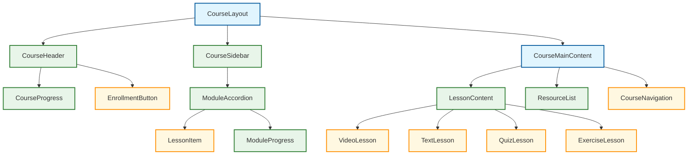
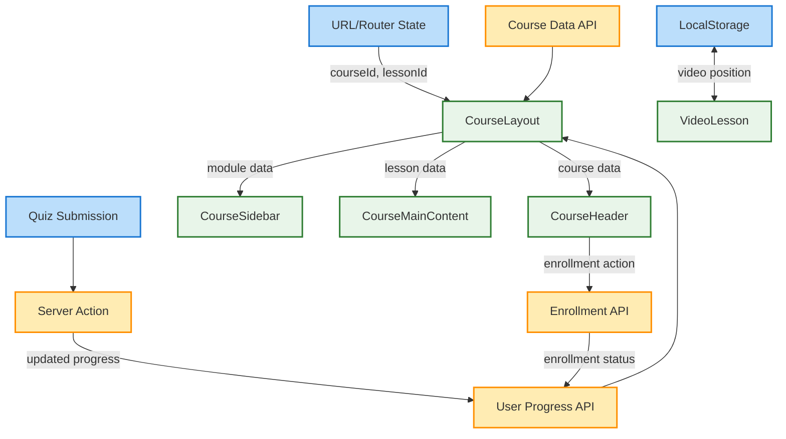
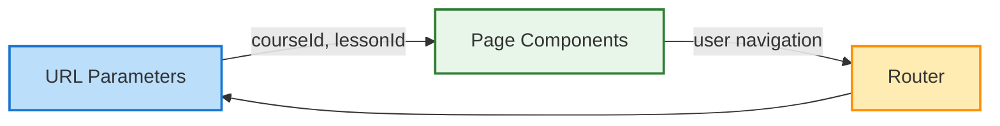
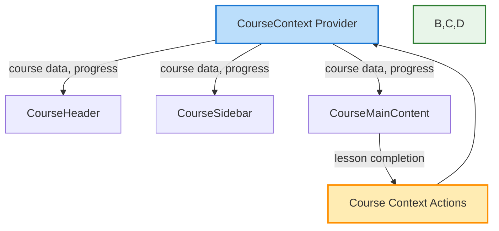
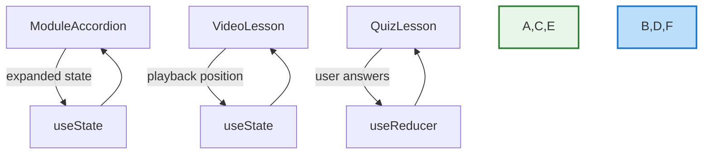
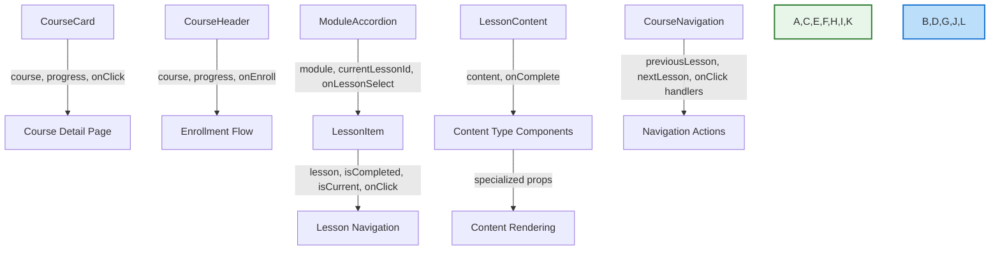

# Course Component Relationships

**Version:** 1.0
**Last Updated:** 2025-04-09
**Status:** Complete

## Overview

This document provides a visual representation of how Course section components relate to each other, including their dependencies, props flow, and state interactions. This serves as an example of component relationship documentation that should be created for each major feature area to facilitate template migration.

## Component Hierarchy Diagram

The following diagram illustrates the hierarchical relationships between Course components:

## Data Flow Diagram

This diagram shows how data flows between components and state management:

## State Management

The Course section employs several types of state management:

### URL State (via useSearchParams)

Key URL parameters:
- `courseId`: Identifies the current course
- `moduleId`: Identifies the current module (optional)
- `lessonId`: Identifies the current lesson
- `view`: Controls the display mode (e.g., "overview", "content")

### Context-based State

The CourseContext provides:
- Course metadata
- Module and lesson data
- User progress information
- Actions for updating progress

### Local Component State

## Props Interface Relationships

The following diagram shows how props are passed between key components:

## Template Dependencies

Components with high template dependencies that require special migration attention:

1. **CourseLayout**:
   - Depends on page layout and grid system
   - Controls responsive behavior between sidebar and main content

2. **CourseHeader**:
   - Uses template typography system
   - Follows template image aspect ratios and responsive sizing

3. **ModuleAccordion**:
   - Uses template animation and transition styles
   - Relies on template spacing and expandable component patterns

4. **LessonItem**:
   - Uses template icon system
   - Follows template interactive element patterns

## Migration Considerations

When migrating the Course section to a new template:

1. **Start with Container Components:**
   - Begin with CourseLayout as it defines the overall structure
   - Adapt its responsive breakpoints to match the new template

2. **Preserve State Management:**
   - Maintain the existing state flow between components
   - Ensure URL parameters continue to control navigation state

3. **Isolate UI Changes:**
   - Create adapter components to bridge styling differences
   - Update component internals while preserving their APIs

4. **Test Progressive Migration:**
   - Consider a hybrid approach where components are migrated individually
   - Test each migrated component with both old and new components

## Related Documentation

- [Course Data Architecture](course-data-architecture.md)
- [Course Components](course-components.md)
- [Template Migration Guide](template-migration-guide.md)
