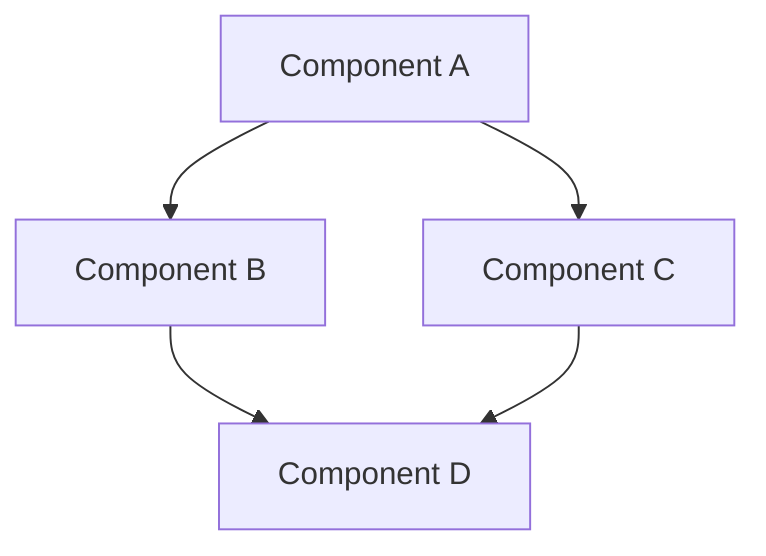

# [Document Title]

**Version:** 1.0
**Last Updated:** [Date in YYYY-MM-DD format]
**Status:** [Draft/In Progress/Complete]

## Overview

[A concise description of what this document covers and its purpose. This section should answer the "what" and "why" of the documented component/feature/concept.]

## Key Concepts

[Define any important concepts, terms, or principles that are essential to understanding the topic. Use bullet points for clarity.]

- **[Concept Name]**: [Brief definition/explanation]
- **[Concept Name]**: [Brief definition/explanation]
- **[Concept Name]**: [Brief definition/explanation]

## Architecture/Structure

[Describe the overall structure, architecture, or organization of the topic. Include diagrams where helpful.]



## API Reference

[For components or features with APIs, document the interface in detail.]

### [Interface/Component/Function Name]

**Props/Parameters:**

```typescript
interface PropsType {
  required: string;
  optional?: number;
  callback: (value: string) => void;
  children?: React.ReactNode;
}
```

**Return Value/Rendered Output:**

[Description of what the component renders or what the function returns]

**Example Usage:**

```tsx
<Component
  required="example"
  callback={(value) => console.log(value)}
>
  Child content
</Component>
```

## Implementation Details

[Provide more detailed information about how the feature/component is implemented. Include code snippets where relevant.]

### Data Flow

[Describe how data flows through the component/feature, especially for components with state.]

### State Management

[Explain how state is managed within the component/feature.]

### Edge Cases and Limitations

[Document any known edge cases, limitations, or potential issues.]

## Accessibility Considerations

[Document accessibility features, ARIA attributes, keyboard navigation, and other accessibility concerns.]

## Browser/Device Compatibility

[Document any browser-specific behaviors or device considerations.]

## Performance Considerations

[Document any performance optimizations or considerations.]

## Related Documentation

[Link to other relevant documentation.]

- [Link to related doc 1](path/to/doc1.md)
- [Link to related doc 2](path/to/doc2.md)

## Examples

[Provide comprehensive examples showing the component/feature in action.]

### Basic Example

[Simple example demonstrating core functionality]

### Advanced Example

[More complex example demonstrating advanced usage]

## Migration Notes

[For components that have undergone significant changes, document migration considerations for developers.]

### From v1.x to v2.x

[Document specific migration steps or API changes]

## Changelog

| Date | Version | Changes |
|------|---------|---------|
| YYYY-MM-DD | 1.0 | Initial documentation |
| YYYY-MM-DD | 1.1 | Updated with new features |
