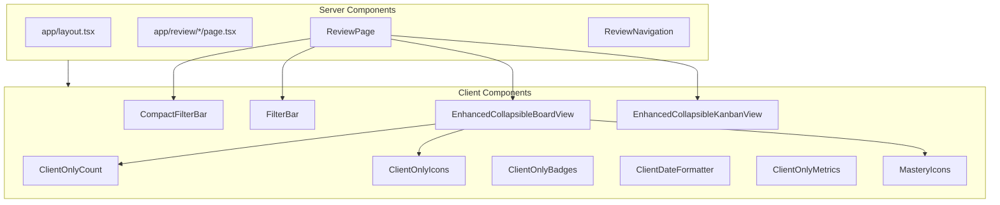

# Application Page Structure

This document provides a comprehensive overview of the application's page structure and component hierarchy using mermaid diagrams.

## Main Application Structure

```mermaid
graph TD
    A[Layout - src/app/layout.tsx] --> B[Pages]
    A --> C[MainNavigationBar]

    B --> D[Dashboard]
    B --> E[Review]
    B --> F[Question Bank]
    B --> G[Overview]
    B --> H[Course]
    B --> I[Mock Test]

    %% Review section expanded
    E --> J[Set View]
    E --> K[Question View]
    E --> L[Timeline View]
    E --> M[Board View]
    E --> N[Kanban View]

    %% Set View details
    J --> J1[SetViewTable]
    J --> J2[SetViewTabs]
    J --> J3[SetViewTabsDemo]

    %% Question View details
    K --> K1[SimpleQuestionView]
    K --> K2[EnhancedMatrixGridView]
    K --> K3[FlashcardView]
    K --> K4[SteampunkMachineryView]
    K --> K5[QuestionViewTabs]
    
    %% Timeline View details
    L --> L1[TimelineView]
    L --> L2[TimelineInspiredListView]
    L --> L3[TimelineViewTabs]
    
    %% Board View details
    M --> M1[EnhancedCollapsibleBoardView]
    M --> M2[InteractiveBoardCard]
    
    %% Kanban View details
    N --> N1[EnhancedCollapsibleKanbanView]
    N --> N2[InteractiveKanbanCard]

    %% Common Components
    O[Common Components]
    O --> O1[FilterBar]
    O --> O2[CompactFilterBar]
    O --> O3[ErrorBoundary]
    O --> O4[ClientOnlyComponents]

    O4 --> O4A[ClientOnlyCount]
    O4 --> O4B[ClientOnlyIcons]
    O4 --> O4C[ClientOnlyBadges]
    O4 --> O4D[ClientDateFormatter]
    O4 --> O4E[ClientOnlyMetrics]
```



## Review Section Routes

```mermaid
graph TD
    R[/review] --> S[/review/set]
    R --> T[/review/question]
    R --> U[/review/timeline]
    R --> V[/review/board]
    R --> W[/review/kanban]
    
    %% Route components
    S --> S1[Set View Page]
    T --> T1[Question View Page]
    U --> U1[Timeline View Page]
    V --> V1[Board View Page]
    W --> W1[Kanban View Page]
    
    %% Page compositions
    S1 --> SC1[ReviewPage]
    SC1 --> SC2[ReviewNavigation]
    SC1 --> SC3[SetViewTable / SetViewTabs]
    
    T1 --> TC1[ReviewPage]
    TC1 --> TC2[ReviewNavigation]
    TC1 --> TC3[QuestionViewTabs / SimpleQuestionView]
    
    U1 --> UC1[ReviewPage]
    UC1 --> UC2[ReviewNavigation]
    UC1 --> UC3[TimelineViewTabs]
    
    V1 --> VC1[ReviewPage]
    VC1 --> VC2[ReviewNavigation]
    VC1 --> VC3[EnhancedCollapsibleBoardView]
    
    W1 --> WC1[ReviewPage]
    WC1 --> WC2[ReviewNavigation]
    WC1 --> WC3[EnhancedCollapsibleKanbanView]
```

## Components Hierarchy

```mermaid
graph TD
    %% EnhancedCollapsibleBoardView Hierarchy
    B1[EnhancedCollapsibleBoardView] --> B2[MasteryIcons]
    B1 --> B3[InteractiveBoardCard]
    B1 --> B4[CompactFilterBar]
    B1 --> B5[ClientOnlyCount]
    
    %% MasteryIcons Breakdown
    B2 --> B2A[VeryWeakIcon]
    B2 --> B2B[WeakIcon]
    B2 --> B2C[NotAttemptedIcon]
    B2 --> B2D[EmergingIcon]
    B2 --> B2E[ProficientIcon]
    B2 --> B2F[MasteredIcon]
    
    %% QuestionViewTabs Hierarchy
    Q1[QuestionViewTabs] --> Q2[SimpleQuestionView]
    Q1 --> Q3[EnhancedMatrixGridView]
    Q1 --> Q4[FlashcardView]
    Q1 --> Q5[SteampunkMachineryView]
    
    %% TimelineViewTabs Hierarchy
    T1[TimelineViewTabs] --> T2[TimelineView]
    T1 --> T3[TimelineInspiredListView]
    
    %% EnhancedMatrixGrid Hierarchy
    E1[EnhancedMatrixGrid] --> E2[TableHeader]
    E1 --> E3[MatrixRow]
    E1 --> E4[useMatrixData Hook]
    
    %% Performance Insights Hierarchy
    P1[Performance Insights] --> P2[PerformanceInsights]
    P1 --> P3[PerformanceInsightsSimple]
```



## Client/Server Component Structure



## Hydration Solution Strategy

```mermaid
graph TD
    subgraph Problem ["Hydration Issues"]
        P1[Variable Content Between Server/Client]
        P2[Dynamic Content Generation]
        P3[Inconsistent Date Formatting]
        P4[Environment-dependent Outputs]
    end
    
    subgraph Solution ["Hydration Solutions"]
        S1[Client Components with 'use client']
        S2[Consistent Data Sources]
        S3[ClientOnly* Components]
        S4[Stable Component Props]
        S5[Deterministic Rendering]
    end
    
    P1 --> S1
    P1 --> S3
    P2 --> S2
    P2 --> S4
    P3 --> S3
    P4 --> S5
    
    S3 --> R1[Wrapping variable content in client components]
    S4 --> R2[Ensuring consistent props between server/client]
    S5 --> R3[Avoiding Math.random() and Date.now()]
```

## User Flow

```mermaid
graph TD
    Start[User Lands on Home] --> Review[Review Section]
    
    Review --> SetView[Set View Page]
    Review --> Timeline[Timeline View]
    Review --> Board[Board View]
    Review --> Kanban[Kanban View]
    
    SetView --> SelectSet[Select Practice Set]
    SelectSet --> QuestionView[Question View Page]
    
    Board --> BoardPopup[View Category Details]
    BoardPopup --> SelectQuestion[Select Question]
    SelectQuestion --> QuestionView
    
    Kanban --> KanbanPopup[View Category Details]
    KanbanPopup --> SelectQuestion
    
    Timeline --> TimelineSelect[Select Entry]
    TimelineSelect --> QuestionView
    
    QuestionView --> Complete[Complete Practice]
    Complete --> Dashboard[Dashboard/Results]
    Dashboard --> Review
