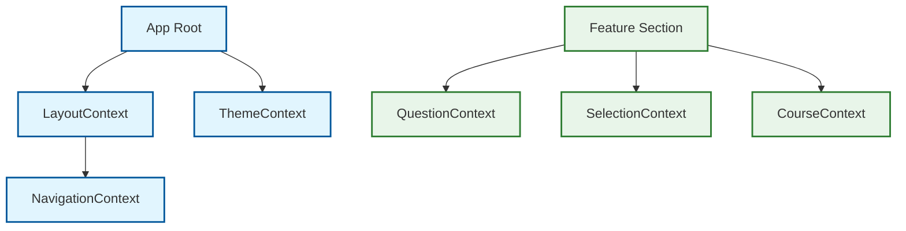
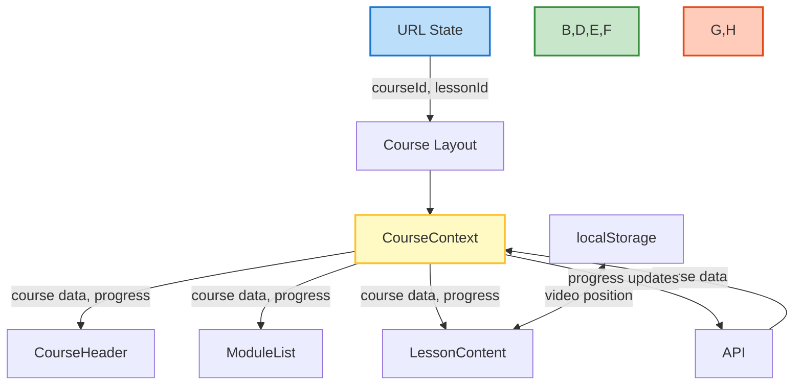
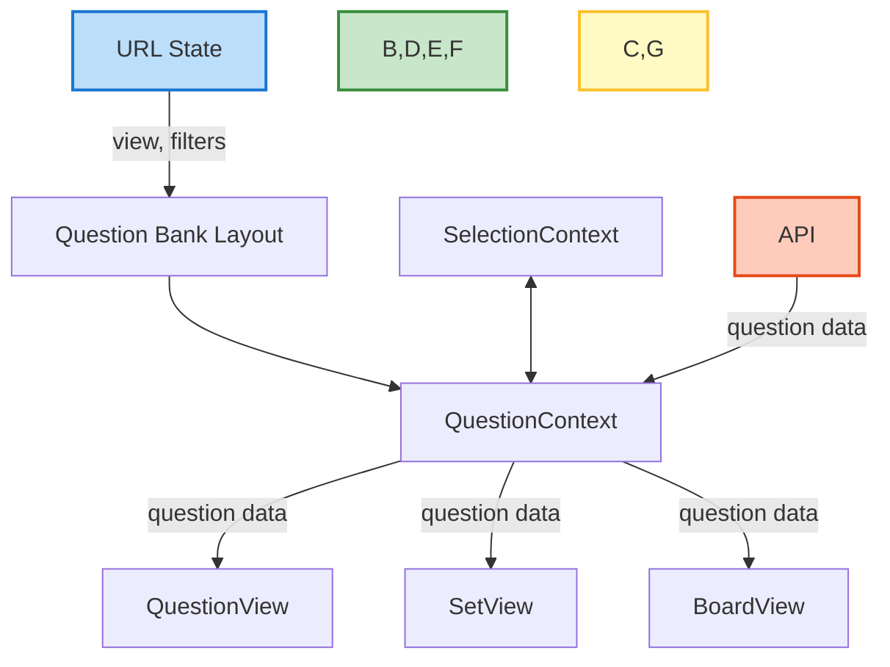

# State Management Patterns

**Version:** 1.0
**Last Updated:** 2025-04-09
**Status:** Complete

## Overview

This document describes the state management patterns used throughout the Syntax education platform. Understanding these patterns is crucial for maintaining application behavior during template migration.

## Pattern Categories

The application uses several state management approaches, each with specific use cases:

1. **URL-based State** (via `useSearchParams`)
2. **React Context** (for shared state across component trees)  
3. **Component-local State** (using React's `useState` and `useReducer`)
4. **Server State** (via React Server Components and API calls)
5. **Persistent State** (using localStorage/sessionStorage)

## 1. URL-based State

URL parameters provide shareable, bookmarkable state that persists across page refreshes.

### Implementation

```tsx
// Client component using URL state
'use client'

import { useSearchParams, usePathname, useRouter } from 'next/navigation'
import { Suspense } from 'react'

function FilterComponent() {
  const searchParams = useSearchParams()
  const pathname = usePathname()
  const router = useRouter()
  
  // Get current parameter value with fallback
  const currentSubject = searchParams.get('subject') || 'all'
  
  const updateFilter = (subject: string) => {
    // Create a new URLSearchParams instance to avoid direct mutation
    const params = new URLSearchParams(searchParams)
    
    // Update the parameter
    params.set('subject', subject)
    
    // Update the URL, preserving other parameters
    router.push(`${pathname}?${params.toString()}`)
  }
  
  return (
    <div>
      <select 
        value={currentSubject}
        onChange={(e) => updateFilter(e.target.value)}
      >
        <option value="all">All Subjects</option>
        <option value="math">Math</option>
        <option value="science">Science</option>
      </select>
    </div>
  )
}

// Wrap with Suspense in parent component
export function FilterWrapper() {
  return (
    <Suspense fallback={<div>Loading filters...</div>}>
      <FilterComponent />
    </Suspense>
  )
}
```

### Key Considerations for Migration

- Always wrap components using `useSearchParams` in a Suspense boundary
- Follow best practices in [`use-search-params-guide.md`](use-search-params-guide.md)
- Preserve URL parameter names and formats for consistent behavior
- Ensure all search parameter operations create a new URLSearchParams instance

## 2. React Context

Context provides a way to share values between components without explicitly passing props through every level.

### Common Contexts in the Application



### Implementation Pattern

```tsx
// Context definition
import { createContext, useContext, useState, ReactNode } from 'react'

// Define context type
interface FeatureContextType {
  selectedItem: string | null
  setSelectedItem: (id: string | null) => void
  isLoading: boolean
  setIsLoading: (state: boolean) => void
}

// Create context with default values
const FeatureContext = createContext<FeatureContextType>({
  selectedItem: null,
  setSelectedItem: () => {},
  isLoading: false,
  setIsLoading: () => {},
})

// Provider component
export function FeatureProvider({ children }: { children: ReactNode }) {
  const [selectedItem, setSelectedItem] = useState<string | null>(null)
  const [isLoading, setIsLoading] = useState(false)
  
  return (
    <FeatureContext.Provider value={{
      selectedItem,
      setSelectedItem,
      isLoading,
      setIsLoading
    }}>
      {children}
    </FeatureContext.Provider>
  )
}

// Custom hook for consuming the context
export function useFeature() {
  const context = useContext(FeatureContext)
  
  if (context === undefined) {
    throw new Error('useFeature must be used within a FeatureProvider')
  }
  
  return context
}
```

### Key Considerations for Migration

- Maintain the same context hierarchy and provider order
- Preserve all context values and action patterns
- Keep context provider wrappers at the same component level
- Verify that context consumers receive the expected values

## 3. Component-local State

Local component state is used for UI interactions and component-specific behavior.

### Common Patterns

```tsx
// useState for simple state
function SimpleComponent() {
  const [isOpen, setIsOpen] = useState(false)
  const [value, setValue] = useState('')
  
  return (
    <div>
      <button onClick={() => setIsOpen(!isOpen)}>
        Toggle
      </button>
      {isOpen && (
        <input
          value={value}
          onChange={(e) => setValue(e.target.value)}
        />
      )}
    </div>
  )
}

// useReducer for complex state
function ComplexComponent() {
  const initialState = { count: 0, lastAction: null }
  
  const reducer = (state, action) => {
    switch(action.type) {
      case 'increment':
        return { count: state.count + 1, lastAction: 'increment' }
      case 'decrement':
        return { count: state.count - 1, lastAction: 'decrement' }
      default:
        return state
    }
  }
  
  const [state, dispatch] = useReducer(reducer, initialState)
  
  return (
    <div>
      <p>Count: {state.count}</p>
      <p>Last action: {state.lastAction}</p>
      <button onClick={() => dispatch({ type: 'increment' })}>+</button>
      <button onClick={() => dispatch({ type: 'decrement' })}>-</button>
    </div>
  )
}
```

### Key Considerations for Migration

- Maintain the same state initialization patterns
- Preserve reducer logic and action types
- Keep dependencies arrays in useEffect hooks identical
- Pay attention to initialization timing and lifecycles

## 4. Server State

React Server Components and data fetching patterns for server-driven state.

### Implementation Patterns

```tsx
// Server Component data fetching
async function CourseList() {
  // This runs on the server
  const courses = await fetchCourses()
  
  return (
    <div>
      {courses.map(course => (
        <CourseCard key={course.id} course={course} />
      ))}
    </div>
  )
}

// Client Component API data fetching
'use client'

function UserProgress() {
  const [progress, setProgress] = useState(null)
  const [isLoading, setIsLoading] = useState(true)
  const [error, setError] = useState(null)
  
  useEffect(() => {
    async function fetchData() {
      try {
        setIsLoading(true)
        const response = await fetch('/api/user/progress')
        const data = await response.json()
        setProgress(data)
      } catch (err) {
        setError(err)
      } finally {
        setIsLoading(false)
      }
    }
    
    fetchData()
  }, [])
  
  if (isLoading) return <LoadingSpinner />
  if (error) return <ErrorMessage error={error} />
  
  return <ProgressDisplay data={progress} />
}
```

### Key Considerations for Migration

- Preserve the server/client component boundary
- Maintain API endpoint URLs and response handling
- Keep error handling patterns consistent
- Pay attention to loading state management

## 5. Persistent State

State that persists across page refreshes using browser storage.

### Implementation Pattern

```tsx
'use client'

import { useState, useEffect } from 'react'

// Custom hook for localStorage
function useLocalStorage(key, initialValue) {
  // State to store our value
  const [storedValue, setStoredValue] = useState(() => {
    if (typeof window === 'undefined') {
      return initialValue
    }
    
    try {
      const item = window.localStorage.getItem(key)
      return item ? JSON.parse(item) : initialValue
    } catch (error) {
      console.log(error)
      return initialValue
    }
  })
  
  // Return a wrapped version of useState's setter function
  const setValue = (value) => {
    try {
      // Allow value to be a function
      const valueToStore =
        value instanceof Function ? value(storedValue) : value
        
      // Save state
      setStoredValue(valueToStore)
      
      // Save to localStorage
      if (typeof window !== 'undefined') {
        window.localStorage.setItem(key, JSON.stringify(valueToStore))
      }
    } catch (error) {
      console.log(error)
    }
  }
  
  return [storedValue, setValue]
}

// Usage
function ThemeSelector() {
  const [theme, setTheme] = useLocalStorage('theme', 'light')
  
  return (
    <select
      value={theme}
      onChange={(e) => setTheme(e.target.value)}
    >
      <option value="light">Light</option>
      <option value="dark">Dark</option>
      <option value="system">System</option>
    </select>
  )
}
```

### Key Considerations for Migration

- Maintain storage key names for consistency
- Preserve fallback and default values
- Keep hydration safety checks in place
- Ensure storage serialization/deserialization patterns remain the same

## Feature-specific State Management

Each feature area has specific state management patterns that should be preserved during migration.

### Course Feature State



### Question Bank State



## Hydration Considerations

State initialization must be handled carefully to prevent hydration mismatches:

1. **Avoid Non-deterministic Initialization**
   ```tsx
   // ❌ Bad: Non-deterministic initialization
   const [value, setValue] = useState(Math.random())
   
   // ✅ Good: Deterministic initialization
   const [value, setValue] = useState(0)
   useEffect(() => {
     setValue(Math.random())
   }, [])
   ```

2. **Client-side Only State Updates**
   ```tsx
   // ❌ Bad: Direct state initialization with browser APIs
   const [width, setWidth] = useState(window.innerWidth)
   
   // ✅ Good: Use useEffect for browser API access
   const [width, setWidth] = useState(0)
   useEffect(() => {
     setWidth(window.innerWidth)
     
     const handleResize = () => setWidth(window.innerWidth)
     window.addEventListener('resize', handleResize)
     return () => window.removeEventListener('resize', handleResize)
   }, [])
   ```

3. **Safely Access Browser APIs**
   ```tsx
   // ❌ Bad: Direct browser API access
   const theme = localStorage.getItem('theme') || 'light'
   
   // ✅ Good: Check for browser environment
   const theme = typeof window !== 'undefined' 
     ? localStorage.getItem('theme') || 'light'
     : 'light'
   ```

## Related Documentation

- [Hydration Errors](HYDRATION_ERRORS.md)
- [useSearchParams Guide](use-search-params-guide.md)
- [Template Migration Guide](template-migration-guide.md)
- [Course Component Relationships](course-component-relationships.md)
