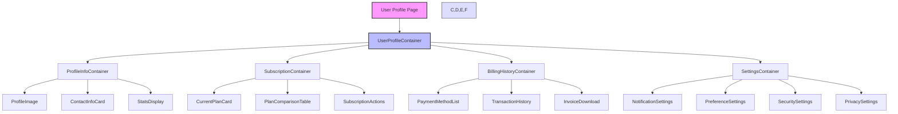

# User Profile Technical Implementation Guide

This document provides detailed technical guidance for developers working on the User Profile section of the BrainBox Learning platform. The implementation follows best practices for maintainability, performance, security, and user experience.

## Architecture Overview

The User Profile section follows a tab-based component architecture using React and Next.js, with client-side state management for user interactions and server-side data fetching for persistent data. The architecture is designed to be modular, scalable, and maintainable.



### Technology Stack

- **Frontend**: 
  - Next.js 14+ (App Router)
  - React 18+ (with Server Components)
  - TypeScript 5+
  
- **UI Components**: 
  - Custom components with Tailwind CSS
  - Fully responsive design principles
  - Shared UI library for consistent styling
  
- **Icons & Assets**: 
  - Lucide React for consistent iconography
  - Optimized SVGs for performance
  - Next/Image for optimized image loading
  
- **State Management**: 
  - React useState for local component state
  - useContext for shared state (theme, user data)
  - React Query for server state
  - Optional: Zustand for complex global state
  
- **Data Fetching**: 
  - React Query or SWR for data fetching, caching, and synchronization
  - Next.js API routes for backend communication
  - Custom hooks for encapsulating data fetching logic

- **Form Management**:
  - React Hook Form for form state and validation
  - Zod for schema validation
  - Custom form components with accessibility built-in
  
- **Testing**:
  - Jest for unit testing
  - React Testing Library for component testing
  - Cypress for end-to-end testing
  - MSW for API mocking

- **Accessibility**:
  - ARIA attributes for screen readers
  - Keyboard navigation support
  - Focus management
  - Color contrast compliance

## Component Architecture

```
src/app/user/
├── page.tsx (Next.js page component)
├── error.tsx (Error handling)
└── loading.tsx (Loading state)

src/components/user/containers/
├── UserProfileContainer.tsx (Main container with tabs)
├── ProfileInfoContainer.tsx (Profile management)
├── SubscriptionContainer.tsx (Subscription management)
├── BillingHistoryContainer.tsx (Billing and payment history)
└── SettingsContainer.tsx (User settings and preferences)

src/components/user/ui/
├── ProfileImage.tsx (Profile image with upload capability)
├── ContactInfoCard.tsx (Contact information display and edit)
├── StatsDisplay.tsx (Learning statistics visualization)
├── PlanComparisonTable.tsx (Subscription plans comparison)
├── PaymentMethodCard.tsx (Payment method display and management)
├── TransactionItem.tsx (Transaction history item)
├── InvoiceDownloadButton.tsx (Invoice download functionality)
└── ToggleSettings.tsx (Settings toggle with accessibility)

src/components/ui/
├── Button.tsx (Shared button component)
├── Card.tsx (Shared card component)
├── Tabs.tsx (Shared tabs component)
├── Switch.tsx (Toggle switch component)
├── Badge.tsx (Status badge component)
├── Dialog.tsx (Modal dialog component)
└── [Other shared UI components]

src/hooks/user/
├── useUserProfile.ts (Profile data management)
├── useSubscription.ts (Subscription management)
├── usePaymentMethods.ts (Payment methods management)
├── useTransactions.ts (Transaction history management)
└── useUserSettings.ts (User settings management)

src/lib/user/
├── profileValidation.ts (Profile data validation schemas)
├── subscriptionUtils.ts (Subscription helper functions)
├── paymentProcessing.ts (Payment processing utilities)
└── settingsStorage.ts (Settings persistence utilities)

src/api/user/
├── profile.ts (Profile API routes handlers)
├── subscription.ts (Subscription API routes handlers)
├── billing.ts (Billing API routes handlers)
└── settings.ts (Settings API routes handlers)
```

## Implementation Details

### 1. Page Component (Next.js)

The page component serves as the entry point for the user profile route, implementing Next.js App Router conventions.

```tsx
// src/app/user/page.tsx
import React from 'react';
import { Metadata } from 'next';
import { getServerSession } from 'next-auth/next';
import { authOptions } from '@/app/api/auth/[...nextauth]/route';
import UserProfileContainer from '@/components/user/containers/UserProfileContainer';
import { redirect } from 'next/navigation';
import { getUserProfile } from '@/lib/user/profileService';

export const metadata: Metadata = {
  title: 'User Profile | BrainBox Learning',
  description: 'View and manage your account, subscription, and billing information',
  openGraph: {
    title: 'User Profile | BrainBox Learning',
    description: 'Manage your BrainBox Learning account, subscription, and settings',
    images: ['/images/profile-og.jpg'],
  }
};

export default async function UserProfilePage() {
  // Get authenticated user session
  const session = await getServerSession(authOptions);
  
  // Redirect to login if not authenticated
  if (!session?.user) {
    redirect('/login?callbackUrl=/user');
    return null;
  }
  
  // Get user ID from session
  const userId = session.user.id;
  
  // Pre-fetch initial profile data for SSR
  const initialProfileData = await getUserProfile(userId);
  
  return (
    <div className="container max-w-7xl mx-auto pt-8 pb-0 px-4 sm:px-6 lg:px-8">
      <div className="bg-card text-card-foreground shadow-sm rounded-xl border border-border">
        <div className="p-6">
          <UserProfileContainer 
            userId={userId} 
            initialProfileData={initialProfileData} 
          />
        </div>
      </div>
    </div>
  );
}

// Error boundary
export function ErrorBoundary({ error }: { error: Error }) {
  return (
    <div className="container max-w-7xl mx-auto p-8 text-center">
      <h2 className="text-2xl font-bold mb-4">Something went wrong</h2>
      <p className="text-muted-foreground mb-4">We encountered an error loading your profile</p>
      <pre className="bg-muted p-4 rounded text-left overflow-auto">
        {error.message}
      </pre>
      <button 
        onClick={() => window.location.reload()}
        className="mt-4 px-4 py-2 bg-primary text-primary-foreground rounded"
      >
        Try again
      </button>
    </div>
  );
}

// Loading state
export function Loading() {
  return (
    <div className="container max-w-7xl mx-auto pt-8 pb-0 px-4 sm:px-6 lg:px-8">
      <div className="bg-card text-card-foreground shadow-sm rounded-xl border border-border p-6">
        <div className="animate-pulse">
          <div className="h-8 w-48 bg-muted rounded mb-6"></div>
          <div className="space-y-4">
            <div className="h-4 bg-muted rounded w-full"></div>
            <div className="h-4 bg-muted rounded w-5/6"></div>
            <div className="h-4 bg-muted rounded w-4/6"></div>
          </div>
        </div>
      </div>
    </div>
  );
}
```

### 2. Tab Container Component

The tab container manages the different sections of the user profile. It implements URL-based navigation, lazy loading, and accessibility features.

```tsx
// src/components/user/containers/UserProfileContainer.tsx
"use client";

import React, { useState, useEffect, lazy, Suspense } from 'react';
import { Tabs, TabsList, TabsTrigger, TabsContent } from '@/components/ui/Tabs';
import { User, CreditCard, Clock, Settings } from 'lucide-react';
import { useRouter, useSearchParams } from 'next/navigation';
import { useUserProfile } from '@/hooks/user/useUserProfile';
import { UserProfile } from '@/types/user';

// Lazy load tab contents for better performance
const ProfileInfoContainer = lazy(() => import('./ProfileInfoContainer'));
const SubscriptionContainer = lazy(() => import('./SubscriptionContainer'));
const BillingHistoryContainer = lazy(() => import('./BillingHistoryContainer'));
const SettingsContainer = lazy(() => import('./SettingsContainer'));

// Loading component for Suspense
const TabLoading = () => (
  <div className="flex justify-center items-center py-12">
    <div className="animate-spin h-8 w-8 border-4 border-primary border-t-transparent rounded-full"></div>
  </div>
);

type TabKey = 'profile' | 'subscription' | 'billing' | 'settings';

interface UserProfileContainerProps {
  userId: string;
  initialProfileData?: UserProfile;
  initialTab?: TabKey;
  className?: string;
}

const UserProfileContainer: React.FC<UserProfileContainerProps> = ({
  userId,
  initialProfileData,
  initialTab = 'profile',
  className = '',
}) => {
  const router = useRouter();
  const searchParams = useSearchParams();
  
  // Get tab from URL params if available, otherwise use default
  const tabParam = searchParams.get('tab') as TabKey | null;
  const [activeTab, setActiveTab] = useState<TabKey>(tabParam || initialTab);
  
  // Get user profile data with React Query
  const { data: profile, isLoading, error } = useUserProfile(userId, {
    initialData: initialProfileData
  });
  
  // Update URL when tab changes without causing a page reload
  useEffect(() => {
    const newSearchParams = new URLSearchParams(searchParams);
    newSearchParams.set('tab', activeTab);
    router.replace(`/user?${newSearchParams.toString()}`, { scroll: false });
  }, [activeTab, router, searchParams]);
  
  // Handle tab changing
  const handleTabChange = (value: string) => {
    setActiveTab(value as TabKey);
    
    // Announce tab change to screen readers
    const announcement = document.getElementById('tab-change-announcement');
    if (announcement) {
      announcement.textContent = `${value} tab activated`;
    }
  };
  
  if (isLoading && !initialProfileData) {
    return <TabLoading />;
  }
  
  if (error) {
    return (
      <div className="bg-destructive/10 text-destructive p-4 rounded-md">
        <h3 className="font-semibold">Error loading profile</h3>
        <p>{error.message}</p>
        <button
          onClick={() => window.location.reload()}
          className="mt-2 px-3 py-1 bg-background border border-input rounded-md text-sm"
        >
          Retry
        </button>
      </div>
    );
  }

  return (
    <Tabs
      defaultValue={activeTab}
      value={activeTab}
      onValueChange={handleTabChange}
      className={`w-full ${className}`}
    >
      {/* Hidden live region for screen reader announcements */}
      <div 
        id="tab-change-announcement" 
        className="sr-only" 
        aria-live="polite" 
        aria-atomic="true"
      ></div>
      
      <div className="border-b border-border mb-6 overflow-x-auto scrollbar-thin">
        <TabsList 
          className="w-full justify-start bg-transparent p-0 min-w-max"
          aria-label="User profile sections"
        >
          <TabsTrigger 
            value="profile" 
            variant="underline" 
            className="py-3 px-5 font-medium"
          >
            <User className="mr-2 h-4 w-4" aria-hidden="true" />
            <span>Profile</span>
          </TabsTrigger>
          <TabsTrigger 
            value="subscription" 
            variant="underline" 
            className="py-3 px-5 font-medium"
          >
            <CreditCard className="mr-2 h-4 w-4" aria-hidden="true" />
            <span>Subscription</span>
          </TabsTrigger>
          <TabsTrigger 
            value="billing" 
            variant="underline" 
            className="py-3 px-5 font-medium"
          >
            <Clock className="mr-2 h-4 w-4" aria-hidden="true" />
            <span>Billing History</span>
          </TabsTrigger>
          <TabsTrigger 
            value="settings" 
            variant="underline" 
            className="py-3 px-5 font-medium"
          >
            <Settings className="mr-2 h-4 w-4" aria-hidden="true" />
            <span>Settings</span>
          </TabsTrigger>
        </TabsList>
      </div>

      <TabsContent value="profile" className="mt-0 focus-visible:outline-none focus-visible:ring-2 focus-visible:ring-ring">
        <Suspense fallback={<TabLoading />}>
          <ProfileInfoContainer userId={userId} initialData={profile} />
        </Suspense>
      </TabsContent>

      <TabsContent value="subscription" className="mt-0 focus-visible:outline-none focus-visible:ring-2 focus-visible:ring-ring">
        <Suspense fallback={<TabLoading />}>
          <SubscriptionContainer userId={userId} />
        </Suspense>
      </TabsContent>

      <TabsContent value="billing" className="mt-0 focus-visible:outline-none focus-visible:ring-2 focus-visible:ring-ring">
        <Suspense fallback={<TabLoading />}>
          <BillingHistoryContainer userId={userId} />
        </Suspense>
      </TabsContent>

      <TabsContent value="settings" className="mt-0 focus-visible:outline-none focus-visible:ring-2 focus-visible:ring-ring">
        <Suspense fallback={<TabLoading />}>
          <SettingsContainer userId={userId} />
        </Suspense>
      </TabsContent>
    </Tabs>
  );
};

export default UserProfileContainer;
```

### 3. Profile Info Container

This component displays and manages the user's profile information. It includes features for viewing and editing the user's profile, with robust form validation and image upload capabilities.

```tsx
// src/components/user/containers/ProfileInfoContainer.tsx
"use client";

import React, { useState } from 'react';
import { Card } from '@/components/ui/card';
import { Button } from '@/components/ui/button';
import { 
  User, Mail, Phone, Building, MapPin, Pencil, 
  Save, X, Upload, AlertTriangle 
} from 'lucide-react';
import { useForm } from 'react-hook-form';
import { zodResolver } from '@hookform/resolvers/zod';
import { profileSchema } from '@/lib/user/profileValidation';
import { useUserProfile } from '@/hooks/user/useUserProfile';
import ProfileImage from '@/components/user/ui/ProfileImage';
import ContactInfoCard from '@/components/user/ui/ContactInfoCard';
import StatsDisplay from '@/components/user/ui/StatsDisplay';
import { UserProfile } from '@/types/user';
import { toast } from '@/components/ui/toast';

interface ProfileInfoContainerProps {
  userId: string;
  initialData?: UserProfile;
}

const ProfileInfoContainer: React.FC<ProfileInfoContainerProps> = ({ 
  userId,
  initialData 
}) => {
  const [isEditing, setIsEditing] = useState(false);
  const [newAvatarFile, setNewAvatarFile] = useState<File | null>(null);
  const [avatarPreview, setAvatarPreview] = useState<string | null>(null);
  
  // React Query hook for profile data
  const { 
    data: profile, 
    isLoading, 
    isError, 
    updateProfile,
    updateProfileImage
  } = useUserProfile(userId, { initialData });
  
  // React Hook Form setup with Zod validation
  const { 
    register, 
    handleSubmit, 
    formState: { errors, isDirty, isSubmitting },
    reset
  } = useForm({
    resolver: zodResolver(profileSchema),
    defaultValues: {
      name: profile?.name || '',
      email: profile?.email || '',
      phone: profile?.phone || '',
      company: profile?.company || '',
      location: profile?.location || '',
      biography: profile?.biography || ''
    }
  });
  
  // Update form values when profile data changes
  React.useEffect(() => {
    if (profile) {
      reset({
        name: profile.name,
        email: profile.email,
        phone: profile.phone,
        company: profile.company,
        location: profile.location,
        biography: profile.biography || ''
      });
    }
  }, [profile, reset]);
  
  // Handle avatar file selection
  const handleAvatarChange = (event: React.ChangeEvent<HTMLInputElement>) => {
    const file = event.target.files?.[0];
    if (file) {
      // Validate file type and size
      if (!file.type.startsWith('image/')) {
        toast({
          title: "Invalid file type",
          description: "Please select an image file",
          variant: "destructive"
        });
        return;
      }
      
      if (file.size > 5 * 1024 * 1024) { // 5MB limit
        toast({
          title: "File too large",
          description: "Please select an image smaller than 5MB",
          variant: "destructive"
        });
        return;
      }
      
      // Create preview URL and store file
      const reader = new FileReader();
      reader.onload = (e) => {
        setAvatarPreview(e.target?.result as string);
      };
      reader.readAsDataURL(file);
      setNewAvatarFile(file);
    }
  };
  
  // Handle form submission
  const onSubmit = async (data: any) => {
    try {
      // Update profile data
      await updateProfile(data);
      
      // Upload new avatar if selected
      if (newAvatarFile) {
        await updateProfileImage(newAvatarFile);
        setNewAvatarFile(null);
        setAvatarPreview(null);
      }
      
      // Exit edit mode
      setIsEditing(false);
      
      toast({
        title: "Profile updated",
        description: "Your profile has been successfully updated",
        variant: "default"
      });
    } catch (error) {
      toast({
        title: "Update failed",
        description: error instanceof Error ? error.message : "An unknown error occurred",
        variant: "destructive"
      });
    }
  };
  
  // Cancel editing
  const handleCancel = () => {
    setIsEditing(false);
    setNewAvatarFile(null);
    setAvatarPreview(null);
    reset();
  };
  
  if (isLoading) {
    return <div className="animate-pulse space-y-6">
      {/* Skeleton loading state */}
      <div className="h-32 bg-muted rounded-lg"></div>
      <div className="h-48 bg-muted rounded-lg"></div>
      <div className="h-48 bg-muted rounded-lg"></div>
    </div>;
  }
  
  if (isError || !profile) {
    return <div className="bg-destructive/10 text-destructive p-4 rounded-md">
      <h3 className="font-semibold flex items-center gap-2">
        <AlertTriangle size={16} />
        Error loading profile
      </h3>
      <p className="mt-2">Unable to load your profile information. Please try again later.</p>
    </div>;
  }

  return (
    <div className="space-y-6">
      <form onSubmit={handleSubmit(onSubmit)}>
        <div className="flex flex-col md:flex-row gap-6">
          {/* Profile Image and Basic Info */}
          <Card className="p-6 flex-1">
            <div className="flex flex-col md:flex-row items-center gap-6">
              {/* Profile Image */}
              <div className="relative">
                <ProfileImage 
                  src={avatarPreview || profile.avatarUrl} 
                  alt={profile.name}
                  size="large"
                  editable={isEditing}
                  onUploadClick={() => document.getElementById('avatar-upload')?.click()}
                />
                
                {isEditing && (
                  <input
                    id="avatar-upload"
                    type="file"
                    accept="image/*"
                    className="hidden"
                    onChange={handleAvatarChange}
                    aria-label="Upload profile picture"
                  />
                )}
              </div>
              
              {/* Basic Info */}
              <div className="flex-1 text-center md:text-left">
                {isEditing ? (
                  <div className="space-y-4">
                    <div>
                      <label htmlFor="name" className="block text-sm font-medium mb-1">
                        Name
                      </label>
                      <input
                        id="name"
                        {...register('name')}
                        className="w-full px-3 py-2 border border-gray-300 rounded-md"
                      />
                      {errors.name && (
                        <p className="text-red-500 text-sm mt-1">{errors.name.message}</p>
                      )}
                    </div>
                    
                    <div>
                      <label htmlFor="biography" className="block text-sm font-medium mb-1">
                        Bio
                      </label>
                      <textarea
                        id="biography"
                        {...register('biography')}
                        rows={3}
                        className="w-full px-3 py-2 border border-gray-300 rounded-md"
                      />
                    </div>
                  </div>
                ) : (
                  <>
                    <h2 className="text-2xl font-bold">{profile.name}</h2>
                    <p className="text-muted-foreground">{profile.role}</p>
                    <p className="text-sm text-muted-foreground mt-1">
                      Member since {new Date(profile.joinDate).toLocaleDateString()}
                    </p>
                    {profile.biography && (
                      <p className="mt-2 text-sm">{profile.biography}</p>
                    )}
                  </>
                )}
                
                {/* Edit/Save/Cancel buttons */}
                <div className="mt-4 flex flex-wrap gap-2 justify-center md:justify-start">
                  {isEditing ? (
                    <>
                      <Button 
                        type="submit" 
                        disabled={!isDirty && !newAvatarFile} 
                        className="gap-2"
                      >
                        <Save size={16} />
                        Save Changes
                      </Button>
                      <Button 
                        type="button" 
                        variant="outline" 
                        onClick={handleCancel}
                        className="gap-2"
                      >
                        <X size={16} />
                        Cancel
                      </Button>
                    </>
                  ) : (
                    <Button 
                      type="button" 
                      variant="outline" 
                      onClick={()

### 3. Profile Info Container

This component displays and manages the user's profile information.

**Key implementation details:**
- In a real application, data would be fetched from an API using React Query or SWR
- Form state would be managed with a form library like React Hook Form
- Image uploads would be handled with a file upload service

### 4. Subscription Container

This component displays the user's current subscription and available plans.

**Key implementation details:**
- Plan comparison should be dynamic and based on the user's current plan
- Upgrade/downgrade flow should include confirmation dialogs
- Payment processing would integrate with a payment gateway in production

### 5. Billing History Container

This component displays the user's transaction history and payment methods.

**Key implementation details:**
- Transaction list should support pagination for many transactions
- Invoice downloads would generate PDFs on the server in production
- Payment method management would integrate with a payment processor API

### 6. Settings Container

This component allows users to configure their account settings.

**Key implementation details:**
- Changes should be saved to the server when the save button is clicked
- Toggle switches should be accessible and follow WAI-ARIA practices
- Theme changes should update the application theme immediately

## State Management

For the current implementation, React's useState is used for local component state. In a production environment, consider these options:

1. **React Context**: For shared state across components (e.g., user settings)
2. **React Query**: For server state management and data fetching
3. **Zustand/Jotai**: For more complex state management if needed

Example of a user context:

```tsx
// src/contexts/UserContext.tsx
import React, { createContext, useContext, useState, useEffect } from 'react';
import { UserProfile, UserSettings } from '@/types';

interface UserContextType {
  user: UserProfile | null;
  settings: UserSettings | null;
  updateProfile: (data: Partial<UserProfile>) => Promise<void>;
  updateSettings: (data: Partial<UserSettings>) => Promise<void>;
  isLoading: boolean;
  error: Error | null;
}

const UserContext = createContext<UserContextType | undefined>(undefined);

export const UserProvider: React.FC<{children: React.ReactNode}> = ({ children }) => {
  const [user, setUser] = useState<UserProfile | null>(null);
  const [settings, setSettings] = useState<UserSettings | null>(null);
  const [isLoading, setIsLoading] = useState(true);
  const [error, setError] = useState<Error | null>(null);

  // Fetch user data
  useEffect(() => {
    const fetchUserData = async () => {
      try {
        // In production, fetch from API
        const userData = { /* mock data */ };
        const settingsData = { /* mock data */ };
        
        setUser(userData);
        setSettings(settingsData);
      } catch (err) {
        setError(err instanceof Error ? err : new Error('Unknown error'));
      } finally {
        setIsLoading(false);
      }
    };

    fetchUserData();
  }, []);

  // Update user profile
  const updateProfile = async (data: Partial<UserProfile>) => {
    try {
      // In production, call API
      setUser(prev => prev ? { ...prev, ...data } : null);
    } catch (err) {
      setError(err instanceof Error ? err : new Error('Failed to update profile'));
      throw err;
    }
  };

  // Update user settings
  const updateSettings = async (data: Partial<UserSettings>) => {
    try {
      // In production, call API
      setSettings(prev => prev ? { ...prev, ...data } : null);
    } catch (err) {
      setError(err instanceof Error ? err : new Error('Failed to update settings'));
      throw err;
    }
  };

  return (
    <UserContext.Provider value={{ 
      user, 
      settings, 
      updateProfile, 
      updateSettings, 
      isLoading, 
      error 
    }}>
      {children}
    </UserContext.Provider>
  );
};

export const useUser = () => {
  const context = useContext(UserContext);
  if (context === undefined) {
    throw new Error('useUser must be used within a UserProvider');
  }
  return context;
};
```

## API Integration

In a production environment, the User Profile section would integrate with backend APIs. Here's a sample implementation using React Query:

```tsx
// src/hooks/useUserProfile.ts
import { useQuery, useMutation, useQueryClient } from '@tanstack/react-query';
import { UserProfile } from '@/types';

// API functions
const fetchUserProfile = async (userId: string): Promise<UserProfile> => {
  const response = await fetch(`/api/users/${userId}`);
  if (!response.ok) {
    throw new Error('Failed to fetch user profile');
  }
  return response.json();
};

const updateUserProfile = async (userId: string, data: Partial<UserProfile>): Promise<UserProfile> => {
  const response = await fetch(`/api/users/${userId}`, {
    method: 'PUT',
    headers: {
      'Content-Type': 'application/json',
    },
    body: JSON.stringify(data),
  });
  
  if (!response.ok) {
    throw new Error('Failed to update user profile');
  }
  
  return response.json();
};

// Hook
export function useUserProfile(userId: string) {
  const queryClient = useQueryClient();
  
  const query = useQuery({
    queryKey: ['userProfile', userId],
    queryFn: () => fetchUserProfile(userId),
  });
  
  const mutation = useMutation({
    mutationFn: (data: Partial<UserProfile>) => updateUserProfile(userId, data),
    onSuccess: (data) => {
      queryClient.setQueryData(['userProfile', userId], data);
    },
  });
  
  return {
    profile: query.data,
    isLoading: query.isLoading,
    error: query.error,
    updateProfile: mutation.mutate,
    isUpdating: mutation.isPending,
    updateError: mutation.error,
  };
}
```

## Accessibility Considerations

Ensure all components follow accessibility best practices:

1. All form controls should have proper labels and ARIA attributes
2. Color contrast should meet WCAG AA standards
3. Focus management should be implemented for tabbed interfaces
4. Keyboard navigation should be fully supported
5. Screen reader announcements for important state changes

Example of accessible toggle component:

```tsx
// src/components/ui/Toggle.tsx
import React from 'react';

interface ToggleProps {
  checked: boolean;
  onChange: (checked: boolean) => void;
  label: string;
  description?: string;
  id: string;
}

export const Toggle: React.FC<ToggleProps> = ({
  checked,
  onChange,
  label,
  description,
  id,
}) => {
  return (
    <div className="flex items-center justify-between">
      <div>
        <label htmlFor={id} className="font-medium">
          {label}
        </label>
        {description && (
          <p id={`${id}-description`} className="text-sm text-muted-foreground">
            {description}
          </p>
        )}
      </div>
      <label className="relative inline-flex items-center cursor-pointer">
        <input 
          type="checkbox" 
          className="sr-only peer" 
          checked={checked}
          onChange={(e) => onChange(e.target.checked)}
          id={id}
          aria-describedby={description ? `${id}-description` : undefined}
        />
        <div className="w-11 h-6 bg-gray-200 peer-focus:outline-none peer-focus:ring-2 peer-focus:ring-primary rounded-full peer peer-checked:after:translate-x-full peer-checked:after:border-white after:content-[''] after:absolute after:top-[2px] after:left-[2px] after:bg-white after:border-gray-300 after:border after:rounded-full after:h-5 after:w-5 after:transition-all peer-checked:bg-primary"></div>
      </label>
    </div>
  );
};
```

## Performance Considerations

1. **Code Splitting**: Each tab's content should be lazy-loaded
2. **Memoization**: Use React.memo and useMemo for expensive calculations
3. **Virtualization**: For long lists (e.g., transaction history), use a virtualized list
4. **Image Optimization**: Use Next.js Image component with proper sizing and formats
5. **Cache Management**: Implement proper cache policies for API requests

Example of lazy loading tab content:

```tsx
// src/components/user/containers/UserProfileContainer.tsx
import React, { useState, lazy, Suspense } from 'react';
import { Tabs, TabsList, TabsTrigger, TabsContent } from '@/components/ui/Tabs';
import { User, CreditCard, Clock, Settings } from 'lucide-react';

// Lazy load heavy components
const ProfileInfoContainer = lazy(() => import('./ProfileInfoContainer'));
const SubscriptionContainer = lazy(() => import('./SubscriptionContainer'));
const BillingHistoryContainer = lazy(() => import('./BillingHistoryContainer'));
const SettingsContainer = lazy(() => import('./SettingsContainer'));

// Loading fallback
const TabLoading = () => (
  <div className="p-8 flex justify-center">
    <div className="animate-spin h-8 w-8 border-4 border-primary border-t-transparent rounded-full"></div>
  </div>
);

// Rest of component...

// In the render function:
<TabsContent value="profile" className="mt-0">
  <Suspense fallback={<TabLoading />}>
    <ProfileInfoContainer userId={userId} />
  </Suspense>
</TabsContent>
```

## Testing Strategy

### Unit Tests

Use Jest and React Testing Library for unit testing components:

```tsx
// src/components/user/containers/UserProfileContainer.test.tsx
import { render, screen, fireEvent } from '@testing-library/react';
import UserProfileContainer from './UserProfileContainer';

describe('UserProfileContainer', () => {
  it('renders all tabs', () => {
    render(<UserProfileContainer userId="test-user" />);
    
    expect(screen.getByText('Profile')).toBeInTheDocument();
    expect(screen.getByText('Subscription')).toBeInTheDocument();
    expect(screen.getByText('Billing History')).toBeInTheDocument();
    expect(screen.getByText('Settings')).toBeInTheDocument();
  });
  
  it('switches tabs when clicked', () => {
    render(<UserProfileContainer userId="test-user" />);
    
    // Default tab should be profile
    expect(screen.getByText('Profile')).toHaveAttribute('aria-selected', 'true');
    
    // Click on subscription tab
    fireEvent.click(screen.getByText('Subscription'));
    
    // Subscription tab should now be selected
    expect(screen.getByText('Subscription')).toHaveAttribute('aria-selected', 'true');
    expect(screen.getByText('Profile')).toHaveAttribute('aria-selected', 'false');
  });
});
```

### Integration Tests

Use Cypress for integration testing the complete user profile flow:

```js
// cypress/e2e/user-profile.cy.js
describe('User Profile', () => {
  beforeEach(() => {
    cy.login(); // Custom command to perform login
    cy.visit('/user');
  });
  
  it('displays user information correctly', () => {
    cy.get('h2').should('contain', 'Jane Smith');
    cy.get('[data-test="user-email"]').should('contain', 'jane.smith@example.com');
  });
  
  it('can navigate between tabs', () => {
    // Check profile tab is active by default
    cy.get('[role="tab"][aria-selected="true"]').should('contain', 'Profile');
    
    // Click on subscription tab
    cy.contains('Subscription').click();
    cy.get('[role="tab"][aria-selected="true"]').should('contain', 'Subscription');
    cy.get('[data-test="current-plan"]').should('be.visible');
    
    // Click on billing tab
    cy.contains('Billing History').click();
    cy.get('[role="tab"][aria-selected="true"]').should('contain', 'Billing History');
    cy.get('[data-test="transactions-table"]').should('be.visible');
    
    // Click on settings tab
    cy.contains('Settings').click();
    cy.get('[role="tab"][aria-selected="true"]').should('contain', 'Settings');
    cy.get('[data-test="notification-settings"]').should('be.visible');
  });
  
  it('can update profile information', () => {
    cy.contains('Edit Profile').click();
    cy.get('input[name="phone"]').clear().type('+1 (555) 987-6543');
    cy.contains('Save Changes').click();
    cy.get('[data-test="success-message"]').should('be.visible');
    cy.get('[data-test="user-phone"]').should('contain', '+1 (555) 987-6543');
  });
});
```

## Deployment Considerations

1. **Environment Variables**: Use environment variables for API endpoints and service configurations
2. **Feature Flags**: Implement feature flags for gradually rolling out features
3. **Error Monitoring**: Integrate with error tracking services like Sentry
4. **Analytics**: Add analytics to track user engagement with profile features
5. **CI/CD**: Set up automated testing and deployment workflows

## Documentation

Ensure all components are properly documented:

- JSDoc comments for functions and components
- Storybook stories for UI components
- API specifications for backend integration
- User documentation for the feature

Example JSDoc:

```tsx
/**
 * UserProfileContainer component
 * 
 * This component serves as the main container for the user profile page.
 * It manages tab navigation between different sections of the user profile.
 *
 * @param {Object} props - Component props
 * @param {string} props.userId - The ID of the user
 * @param {('profile'|'subscription'|'billing'|'settings')} [props.initialTab='profile'] - The initial active tab
 * @param {string} [props.className] - Additional CSS classes
 * 
 * @returns {React.ReactElement} The rendered component
 */
```

## Resources

- [Next.js Documentation](https://nextjs.org/docs)
- [React Query Documentation](https://tanstack.com/query/latest)
- [Tailwind CSS Documentation](https://tailwindcss.com/docs)
- [WAI-ARIA Practices](https://www.w3.org/WAI/ARIA/apg/)
- [React Testing Library](https://testing-library.com/docs/react-testing-library/intro/)
