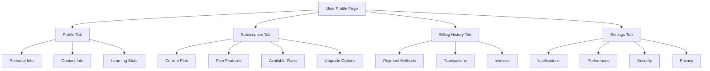

# User Profile and Subscription Management

## Overview

The User Profile section provides users with a centralized interface to manage their profile information, subscription status, billing history, and account settings. It is accessible at `/user` endpoint of the application.



## Features

### 1. Profile Management
- **Personal Information**: Display and edit name, role, join date, and profile picture
  - Secure profile editing with validation and confirmation workflows
  - Profile image upload with size and format restrictions
  - Role-based visibility control for certain profile elements

- **Contact Information**: Manage email, phone, organization, and location
  - Email verification system for changes
  - Phone number formatting and validation
  - Organization directory integration

- **Learning Statistics**: View progress and achievements across the platform
  - Visual metrics for completed courses, learning time, assignments, and scores
  - Trend analysis compared to previous periods
  - Achievement badges and milestones

### 2. Subscription Management
- **Current Plan**: View current subscription details and status
  - Real-time status indicators (active, pending, expired)
  - Billing cycle information with next payment date
  - Usage metrics against plan limits

- **Plan Comparison**: Compare available plans (Free, Standard, Premium)
  - Side-by-side feature comparison
  - Cost-benefit analysis visualization
  - Recommended plan based on usage patterns

- **Plan Features**: See included and excluded features for each plan
  - Clear visual indicators for included/excluded features
  - Feature importance highlighting
  - Contextual information about how features benefit learning

- **Upgrade/Downgrade**: Change subscription tier as needed
  - Seamless upgrade flow with prorated billing
  - Downgrade with scheduled end-of-billing-cycle changes
  - Special offers for retention during downgrade flow

- **Cancel Subscription**: Option to cancel paid subscriptions
  - Retention flow with alternative offers
  - Clear explanation of post-cancellation access
  - Feedback collection for cancellation reasons

### 3. Billing History
- **Payment Methods**: Add, edit, and remove payment methods
  - Multiple payment method support (credit cards, PayPal, etc.)
  - Secure card information handling with PCI compliance
  - Default payment method management

- **Transaction History**: View all past transactions and payment status
  - Filterable transaction list by date, amount, and status
  - Visual indicators for successful, pending, and failed payments
  - Details of what each payment covered (plan, period, etc.)

- **Invoices**: Download invoices for past transactions
  - PDF generation for accounting purposes
  - Email delivery options for invoices
  - Bulk export functionality for all invoices

### 4. Settings
- **Notifications**: Configure email, in-app, marketing, and update notifications
  - Granular control over notification types
  - Frequency settings (immediate, daily digest, weekly)
  - Channel preferences (email, push, SMS)

- **Preferences**: Select theme (light/dark/system) and language
  - Live preview of theme changes
  - Automatic detection of system preferences
  - Regional format settings (date, time, number formats)

- **Security**: Enable two-factor authentication and login notifications
  - Multiple 2FA methods (SMS, authenticator apps, security keys)
  - Login attempt notifications with location and device details
  - Session management and forced logout options

- **Privacy**: Configure data sharing and visibility settings
  - Granular control over what data is shared with teachers/classmates
  - Data export capability for GDPR compliance
  - Option to delete account and associated data

## User Experience Considerations

### Accessibility
- All components meet WCAG AA standards
- Keyboard navigation fully supported throughout all tabs
- Screen reader optimized with proper ARIA attributes
- Sufficient color contrast and text sizing
- Focus management for modal dialogs and form elements

### Responsive Design
- Adapts seamlessly from mobile to desktop view
- Touch-friendly interface elements on mobile
- Appropriate spacing and sizing for all device types
- Critical functions accessible regardless of screen size
- Optimized layout for tablet orientation

### Performance
- Lazy loading of tab content for faster initial page load
- Efficient state management to minimize re-renders
- Image optimization for profile pictures
- Cached subscription and billing data when appropriate
- Virtualized lists for long transaction histories

### Error Handling
- Graceful degradation when services are unavailable
- Clear error messages with recovery actions
- Form validation with instant feedback
- Recovery options for failed payments or upgrades
- Offline support for viewing profile information

## Technical Architecture

The User Profile feature is implemented with a tab-based interface using Next.js and React.

### Component Structure
```
src/app/user/
└── page.tsx (Main user profile page)

src/components/user/containers/
├── UserProfileContainer.tsx (Tab container)
├── ProfileInfoContainer.tsx (Profile information)
├── SubscriptionContainer.tsx (Subscription management)
├── BillingHistoryContainer.tsx (Payment history)
└── SettingsContainer.tsx (User settings)

src/components/user/ui/
├── ProfileImage.tsx (Profile image with upload)
├── ContactInfoCard.tsx (Contact information display)
├── StatsDisplay.tsx (Learning statistics)
├── PlanComparisonTable.tsx (Subscription plans)
├── PaymentMethodCard.tsx (Payment method display)
├── TransactionItem.tsx (Transaction history item)
└── ToggleSettings.tsx (Settings toggle switch)

src/hooks/user/
├── useUserProfile.ts (Profile data management)
├── useSubscription.ts (Subscription management)
├── usePaymentMethods.ts (Payment methods)
├── useTransactions.ts (Transaction history)
└── useUserSettings.ts (User settings)
```

### Key Components

#### UserProfilePage (src/app/user/page.tsx)
- Entry point for the user profile page
- Renders the UserProfileContainer within layout wrapper
- Handles metadata for SEO purposes
- Implements error boundaries for graceful error handling

#### UserProfileContainer (src/components/user/containers/UserProfileContainer.tsx)
- Manages tabs for different sections (Profile, Subscription, Billing, Settings)
- Handles tab switching and state management
- Implements URL-based navigation with query parameters
- Maintains tab state across page refreshes
- Lazy loads tab content for performance optimization

#### ProfileInfoContainer (src/components/user/containers/ProfileInfoContainer.tsx)
- Displays user profile information
- Shows contact details and learning statistics
- Provides interface for editing profile information
- Implements form validation for profile updates
- Handles image upload with preview and cropping
- Displays appropriate loaders during data fetching

#### SubscriptionContainer (src/components/user/containers/SubscriptionContainer.tsx)
- Displays current subscription information
- Shows plan comparison with features
- Provides interface for plan upgrades
- Implements confirmation flows for subscription changes
- Handles payment processing integration
- Displays appropriate messaging for billing cycles
- Implements retention flows for downgrades/cancellations

#### BillingHistoryContainer (src/components/user/containers/BillingHistoryContainer.tsx)
- Manages payment methods
- Displays transaction history
- Provides invoice download functionality
- Implements secure credit card input
- Handles pagination for large transaction histories
- Provides sorting and filtering options
- Integrates with PDF generation for invoices

#### SettingsContainer (src/components/user/containers/SettingsContainer.tsx)
- Manages user preferences and settings
- Handles notification, theme, security, and privacy settings
- Implements toggle controls with appropriate ARIA support
- Provides immediate feedback for setting changes
- Includes confirmation for security-critical changes
- Handles theme switching with system preference detection

## Data Models

### User Profile
```typescript
interface UserProfile {
  id: string;
  name: string;
  email: string;
  phone: string;
  company: string;
  location: string;
  role: string;
  joinDate: string;
  avatarUrl: string;
  biography?: string;
  socialLinks?: {
    linkedin?: string;
    twitter?: string;
    github?: string;
    website?: string;
  };
  skills?: string[];
  emailVerified: boolean;
  lastLoginDate: string;
  preferredContactMethod: 'email' | 'phone' | 'app';
}
```

### Subscription
```typescript
interface Subscription {
  id: string;
  userId: string;
  plan: 'free' | 'standard' | 'premium';
  status: 'active' | 'canceled' | 'expired' | 'past_due' | 'pending';
  startDate: string;
  currentPeriodStart: string;
  currentPeriodEnd: string;
  nextBillingDate: string | null;
  cancelAtPeriodEnd: boolean;
  cardLast4: string | null;
  paymentMethodId: string | null;
  trialEndsAt: string | null;
  cancellationReason?: string;
  metadata?: Record<string, any>;
}
```

### Plan
```typescript
interface Plan {
  id: 'free' | 'standard' | 'premium';
  name: string;
  description: string;
  price: string;
  priceId: string; // Payment processor ID
  period: 'monthly' | 'yearly' | 'forever';
  features: Array<{
    name: string;
    included: boolean;
    description: string;
    highlight: boolean;
  }>;
  limits: {
    coursesPerMonth?: number;
    practiceTestsPerMonth?: number;
    storageLimit?: number;
    concurrentDevices?: number;
  };
  metadata?: Record<string, any>;
}
```

### Transaction
```typescript
interface Transaction {
  id: string;
  userId: string;
  subscriptionId: string | null;
  date: string;
  amount: string;
  amountInCents: number;
  currency: string;
  description: string;
  status: 'completed' | 'pending' | 'failed' | 'refunded';
  paymentMethodId: string;
  paymentMethodType: string;
  paymentMethodLast4: string;
  invoice: string;
  receiptUrl: string;
  refundId: string | null;
  failureReason: string | null;
  metadata?: Record<string, any>;
}
```

### Payment Method
```typescript
interface PaymentMethod {
  id: string;
  userId: string;
  type: 'card' | 'paypal' | 'bank_account';
  brand?: string;
  last4: string;
  expMonth?: number;
  expYear?: number;
  name: string;
  billingAddress?: {
    line1: string;
    line2?: string;
    city: string;
    state?: string;
    postalCode: string;
    country: string;
  };
  isDefault: boolean;
  createdAt: string;
  updatedAt: string;
  fingerprint?: string; // For fraud detection
}
```

### User Settings
```typescript
interface UserSettings {
  userId: string;
  notifications: {
    email: boolean;
    app: boolean;
    marketing: boolean;
    updates: boolean;
    learningReminders: boolean;
    achievementAlerts: boolean;
    weeklyProgressReport: boolean;
    feedbackRequests: boolean;
  };
  preferences: {
    theme: 'light' | 'dark' | 'system';
    language: string;
    timezone: string;
    dateFormat: string;
    timeFormat: '12h' | '24h';
    startPage: 'dashboard' | 'courses' | 'profile';
    contentDensity: 'compact' | 'comfortable' | 'spacious';
  };
  security: {
    twoFactorAuth: boolean;
    twoFactorMethod: 'app' | 'sms' | 'email' | null;
    loginNotifications: boolean;
    recentDevices: Array<{
      deviceId: string;
      deviceName: string;
      lastUsed: string;
      location: string;
    }>;
    passwordLastChanged: string;
    sessionTimeout: number; // in minutes
  };
  privacy: {
    shareProgressWithTeachers: boolean;
    showProfileToClassmates: boolean;
    allowDataAnalytics: boolean;
    showOnlineStatus: boolean;
    showLearningActivity: boolean;
    dataRetentionPeriod: number; // in days
    dataExportRequested: boolean;
    lastDataExportDate: string | null;
  };
  accessibility: {
    highContrast: boolean;
    largerText: boolean;
    reducedMotion: boolean;
    screenReaderOptimized: boolean;
  };
  updatedAt: string;
}
```

## API Endpoints

In a production environment, the following API endpoints would be implemented to support this feature:

### Profile Management
- **GET /api/users/:id** - Get user profile information
- **PUT /api/users/:id** - Update user profile information
- **PATCH /api/users/:id/avatar** - Update user profile image
- **POST /api/users/:id/verify-email** - Send email verification
- **POST /api/users/:id/confirm-email/:token** - Confirm email with token

### Subscription Management
- **GET /api/users/:id/subscription** - Get user subscription details
- **POST /api/subscriptions** - Create a new subscription
- **PUT /api/subscriptions/:id** - Update subscription (upgrade/downgrade)
- **DELETE /api/subscriptions/:id** - Cancel subscription
- **POST /api/subscriptions/:id/resume** - Resume canceled subscription
- **GET /api/plans** - List available subscription plans
- **GET /api/plans/:id** - Get details for a specific plan

### Billing and Payments
- **GET /api/users/:id/transactions** - Get transaction history with pagination
- **GET /api/transactions/:id** - Get details for a specific transaction
- **GET /api/users/:id/payment-methods** - Get payment methods
- **POST /api/users/:id/payment-methods** - Add payment method
- **PUT /api/payment-methods/:id** - Update payment method
- **PATCH /api/payment-methods/:id/set-default** - Set default payment method
- **DELETE /api/payment-methods/:id** - Remove payment method
- **GET /api/invoices/:id** - Download invoice
- **POST /api/invoices/:id/send** - Email invoice to user

### User Settings
- **GET /api/users/:id/settings** - Get user settings
- **PUT /api/users/:id/settings** - Update user settings
- **GET /api/users/:id/settings/notifications** - Get notification settings
- **PUT /api/users/:id/settings/notifications** - Update notification settings
- **GET /api/users/:id/settings/security** - Get security settings
- **PUT /api/users/:id/settings/security** - Update security settings
- **POST /api/users/:id/two-factor/enable** - Enable two-factor authentication
- **DELETE /api/users/:id/two-factor** - Disable two-factor authentication
- **POST /api/users/:id/data-export** - Request data export (GDPR)

### Error Handling
All endpoints should implement standardized error responses:
```typescript
interface ApiError {
  statusCode: number;
  message: string;
  code: string; // Error code for client-side handling
  details?: Record<string, any>; // Additional error context
  validationErrors?: Array<{
    field: string;
    message: string;
  }>;
}
```

## Security Considerations

### Data Protection
- All sensitive user data (payment information, personal details) must be encrypted in transit and at rest
- Payment processing should use tokenization to avoid storing sensitive card data
- Profile information should be protected with appropriate access controls
- Subscription details should only be accessible to the user and authorized administrators

### Authentication & Authorization
- All profile endpoints must verify user authentication
- Authorization checks ensure users can only access their own profile data
- Admin-level operations require additional verification
- Rate limiting applied to sensitive operations (login attempts, payment method changes)

### Compliance Requirements
- GDPR compliance for European users (data export, right to be forgotten)
- CCPA compliance for California residents
- PCI DSS compliance for payment processing
- COPPA compliance for users under 13 (parental consent)

## User Journey Optimizations

### Onboarding
- Guided profile completion during first login
- Progressive disclosure of subscription options
- Clear explanation of plan benefits
- Simplified payment method setup

### Retention Strategies
- Personalized subscription recommendations
- Renewal reminders with value proposition
- Easy plan switching with prorated billing
- Cancellation prevention with targeted offers

### Upgrade Path
- Feature discovery for free users highlighting premium benefits
- Trial periods for premium features
- Easy upgrade flow with minimal friction
- One-click payment for existing payment methods

## Analytics Integration

Key metrics to track:
- Profile completion rate
- Subscription conversion rate
- Plan upgrade/downgrade frequency
- Payment method addition success rate
- Settings modification frequency
- Most commonly toggled settings
- Time spent on each profile tab
- Session duration on profile page

## Future Enhancements

### Short-term
- Email verification workflow for profile updates
- Subscription usage analytics
- Promotional discount system for plan upgrades
- Notification center integration
- Social login integration for profile enrichment
- Profile completeness score with recommendations

### Long-term
- Family/group plan management
- Educational institution billing integration
- Subscription pause functionality
- Enhanced security options (biometric authentication)
- Payment plan options for annual subscriptions
- AI-powered subscription recommendations
- Loyalty program for long-term subscribers
- Referral system with subscription credits

## Screenshots

[Include screenshots of the different tabs and key functionality here]

## Related Documentation
- [Profile Card System](./profile-card-system.md)
- [User Authentication](./user-authentication.md) (to be created)
- [API Documentation](./api-documentation.md) (to be created)
- [Payment Processing Integration](./payment-processing.md) (to be created)
- [Security Guidelines](./security-guidelines.md) (to be created)
