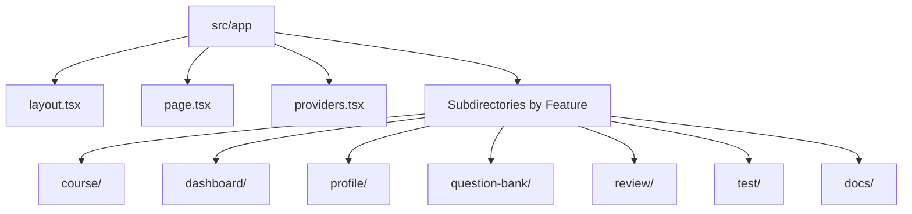
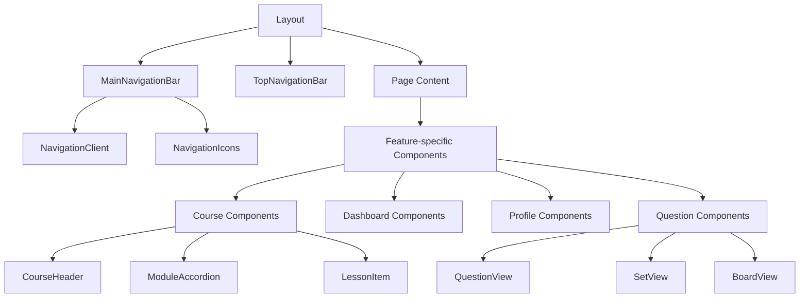

# Template Migration Guide

This guide provides a structured approach for migrating the Syntax education platform to a new template or design system while preserving functionality and improving maintainability.

## Current Site Structure

The Syntax platform currently follows a Next.js App Router architecture with the following key structural elements:

## Component Dependency Map

Understanding component dependencies is critical for a successful migration. Below is a visualization of primary component relationships:

## State Management Patterns

The application uses several state management patterns that must be preserved or carefully migrated:

1. **URL State** (via `useSearchParams`)
   - Used for shareable UI state (filters, selections, views)
   - Follows specific guidelines in [`use-search-params-guide.md`](use-search-params-guide.md)

2. **Context-based State**
   - Feature-specific contexts (e.g., `QuestionContext`, `SelectionContext`)
   - Shared contexts (`LayoutContext`, `DashboardLayoutContext`)

3. **Component State**
   - Local component state for UI interactions
   - Typically used with React's `useState` and `useReducer`

## Template Dependencies and Assumptions

The current components make several assumptions about the template they're in:

1. **Layout Structure**
   - Main content area has specific padding and max-width constraints
   - Navigation elements have fixed positions and z-index values
   - Component spacing follows a consistent scale

2. **Style Dependencies**
   - TailwindCSS utility classes throughout components
   - Custom CSS modules for specific animations and effects
   - Global styles for typography and colors

3. **Asset Dependencies**
   - Icons and images in the `public/` directory
   - Font files loaded through global styles

## Step-by-Step Migration Process

### Phase 1: Preparation

1. **Audit Current Implementation**
   - Document all custom CSS overrides and extensions
   - Identify template-specific components vs. feature components
   - Map component and utility usage across the application

2. **Set Up Migration Environment**
   - Create a separate branch for migration work
   - Set up testing environments for both templates
   - Establish visual regression testing if possible

3. **Create Adapter Components**
   - Design adapter components that can bridge between old and new templates
   - Focus on layout and structural components first

### Phase 2: Core Infrastructure Migration

1. **Migrate Base Layout Structure**
   - Update `layout.tsx` and core layout components
   - Ensure navigation components are adapted to new template
   - Verify responsive behavior across breakpoints

2. **Update Typography and Color Systems**
   - Align with new template's typography scale
   - Map color variables between templates
   - Update global style imports

3. **Migrate Core UI Components**
   - Buttons, inputs, cards, and other foundational elements
   - Maintain consistent API while updating internal implementation

### Phase 3: Feature Migration

1. **Migrate Features in Priority Order**
   - Start with simpler, less state-dependent features
   - Progress to more complex features with careful testing

2. **Update Feature-Specific Components**
   - Maintain component APIs where possible
   - Update internal implementations to use new template patterns
   - Ensure state management patterns are preserved

3. **Update Page Implementations**
   - Adjust page-level components to work with new template
   - Verify routing and navigation remain functional

### Phase 4: Testing and Refinement

1. **Comprehensive Testing**
   - Verify all features work as expected
   - Test across different devices and browsers
   - Check for visual consistency and regressions

2. **Performance Optimization**
   - Measure and optimize performance with new template
   - Identify and fix any inefficiencies introduced

3. **Documentation Update**
   - Update all component documentation
   - Document any API changes or migration notes

## Component Migration Reference

Below is a reference table for major components and their migration considerations:

| Component | Template Dependencies | State Interactions | Migration Priority |
|-----------|----------------------|-------------------|-------------------|
| Layout | High | Global state | High |
| NavigationBar | High | Auth, routing | High |
| CourseComponents | Medium | Course data, progress | Medium |
| QuestionViews | Medium | Question state | Medium |
| ProfileComponents | Low | User data | Low |
| Dashboard | Medium | Multiple data sources | Medium |

## Common Migration Challenges

1. **Hydration Issues**
   - Reference [`HYDRATION_ERRORS.md`](HYDRATION_ERRORS.md) for patterns to avoid
   - Pay special attention to components with client/server rendering differences

2. **Style Conflicts**
   - Watch for CSS specificity issues between templates
   - Use scoped styles where possible to prevent conflicts

3. **Responsive Behavior**
   - Test thoroughly at different breakpoints
   - Ensure new template's responsive utilities are properly applied

4. **Accessibility Regression**
   - Verify accessibility features are preserved or improved
   - Test with screen readers and keyboard navigation

## Migration Checklist

- [ ] Audit current implementation and document dependencies
- [ ] Set up migration environment with testing capabilities
- [ ] Update base layout and navigation components
- [ ] Migrate typography and color systems
- [ ] Update core UI components
- [ ] Migrate features in priority order
- [ ] Test thoroughly across devices and browsers
- [ ] Update documentation to reflect changes
- [ ] Conduct user testing and gather feedback
- [ ] Deploy with gradual rollout strategy

## Resources

- [Next.js App Router Documentation](https://nextjs.org/docs/app)
- [TailwindCSS Migration Guide](https://tailwindcss.com/docs/upgrading-to-v2)
- [React 18 Migration Guide](https://reactjs.org/blog/2022/03/08/react-18-upgrade-guide.html)
