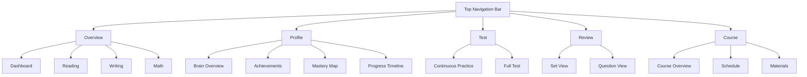

# Topbar Navigation Tree Structure

This document provides a visual representation of the topbar navigation menu structure used throughout the Syntax education platform.

## Navigation Structure



## Navigation Data Structure

The navigation structure is defined in `src/lib/navigation.ts` and follows this pattern:

```typescript
export const navigation = [
  {
    title: 'Section Name',
    links: [
      { title: 'Link Title', href: '/path' },
      // Additional links...
    ],
  },
  // Additional sections...
]
```

## Routes Map

| Section | Link | Route |
|---------|------|-------|
| **Overview** | Dashboard | `/` |
| | Reading | `/overview/reading` |
| | Writing | `/overview/writing` |
| | Math | `/overview/math` |
| **Profile** | Brain Overview | `/profile` |
| | Achievements | `/profile/achievements` |
| | Mastery Map | `/profile/mastery` |
| | Progress Timeline | `/profile/timeline` |
| **Test** | Continuous Practice | `/test/continuous-practice` |
| | Full Test | `/test/full-test` |
| **Review** | Set View | `/review/set` |
| | Question View | `/review/question` |
| **Course** | Course Overview | `/course/course-overview` |
| | Schedule | `/course/schedule` |
| | Materials | `/course/materials` |

## Implementation Notes

The TopNavigationBar component primarily functions as a breadcrumb navigation system that:

1. Shows the current location in the navigation hierarchy
2. Provides quick access to parent sections
3. Displays the current page with a distinctive style

The component uses:
- `usePathname()` from Next.js to get the current route
- The navigation data structure to determine the current page's title and parent section
- A home icon link for quick navigation to the dashboard
- Chevron separators between navigation levels

## Breadcrumb Structure

The breadcrumb navigation follows this pattern:

```
Home Icon > Parent Section > Current Page
```

For example, when viewing the "Question View" page:
```
🏠 > Review > Question View
```

## UI Considerations for Migration

When migrating this component:

1. Maintain the visual hierarchy of the breadcrumb (home → section → page)
2. Preserve the distinctive styling of the current page indicator
3. Ensure the component remains responsive on smaller screens
4. Keep the hover interactions for improved user feedback
5. Maintain accessibility features including proper aria labels

## Related Components

- `MainNavigationBar.tsx` - The primary sidebar navigation
- `NavigationClient.tsx` - Client-side navigation handler
- `NavigationIcons.tsx` - Icon components used in navigation
