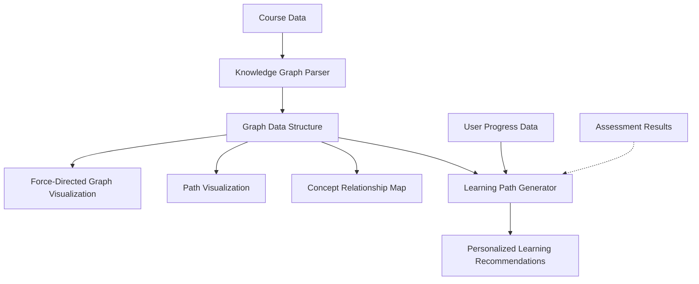

# Course Knowledge Graph Implementation Plan

## Introduction

This implementation plan outlines the approach for integrating a knowledge graph visualization and learning path system into the course pages. The goal is to provide students with an interactive, visual representation of course concepts and their relationships, enabling more personalized learning paths.

## Scope & Goals

### Phase 1 (Current Implementation)
- Create the foundation for knowledge graph visualization
- Design basic data structures for representing course concepts and relationships
- Implement a simple static visualization for the course knowledge graph
- Enable users to view predefined learning paths

### Phase 2 (Future Enhancement)
- Add interactive elements to the knowledge graph
- Implement personalized learning path suggestions
- Integrate with assessment data for adaptive recommendations
- Expand visualization capabilities with filters and different views

## Architecture Overview



## Data Model

### Core Entities

#### 1. Knowledge Node
```typescript
interface KnowledgeNode {
  id: string;
  moduleId: string; // Reference to the containing module
  title: string;
  description: string;
  difficulty: 'beginner' | 'intermediate' | 'advanced';
  importance: 'core' | 'recommended' | 'supplementary';
  estimatedMinutes: number;
  resources: string[]; // IDs of associated resources
  concepts: string[]; // Key concepts contained in this node
  position?: { x: number; y: number }; // Optional position for graph layout
  metadata: Record<string, any>; // Extensible properties
}
```

#### 2. Knowledge Relationship
```typescript
interface KnowledgeRelationship {
  id: string;
  sourceId: string; // ID of the source node
  targetId: string; // ID of the target node
  type: 'prerequisite' | 'builds-upon' | 'relates-to' | 'applies-to' | 'contrasts-with';
  strength: number; // 1-10 indicating relationship strength
  description?: string; // Optional description of the relationship
}
```

#### 3. Learning Path
```typescript
interface LearningPath {
  id: string;
  name: string;
  description: string;
  nodeSequence: string[]; // Ordered array of node IDs
  type: 'comprehensive' | 'accelerated' | 'application' | 'theory' | 'custom';
  estimatedTotalTime: number; // In minutes
  targetAudience?: string; // Who this path is best suited for
}
```

#### 4. Course Knowledge Graph
```typescript
interface CourseKnowledgeGraph {
  courseId: string;
  nodes: KnowledgeNode[];
  relationships: KnowledgeRelationship[];
  predefinedPaths: LearningPath[];
  version: string; // For tracking graph updates
  lastUpdated: string; // ISO timestamp
}
```

## UI Components

### 1. Graph Visualization Component

**Functionality:**
- Renders an interactive force-directed graph of course concepts
- Nodes represent concepts/topics with size reflecting importance
- Edges represent relationships with different colors/styles for relationship types
- Interactive features: zoom, pan, node selection, path highlighting

**Technical Approach:**
- Utilize a visualization library (D3.js/React-Force-Graph/Vis.js)
- Implement custom rendering for nodes based on attributes
- Include hover/click interactions for detailed information
- Add controls for filtering and adjusting the visualization

**UI Design:**
```
+-------------------------------------------------------------+
|                                                             |
|    [Controls]  [Filters]  [Search]  [View Options]          |
|                                                             |
|    +---------------------------------------------------+    |
|    |                                                   |    |
|    |                                                   |    |
|    |                                                   |    |
|    |                 Graph Visualization               |    |
|    |                                                   |    |
|    |                                                   |    |
|    |                                                   |    |
|    |                                                   |    |
|    +---------------------------------------------------+    |
|                                                             |
|    [Legend]                     [Details Panel]             |
|                                                             |
+-------------------------------------------------------------+
```

### 2. Learning Path Component

**Functionality:**
- Displays available learning paths in the course
- Shows user's progress along selected path
- Provides time estimates and difficulty indicators
- Allows switching between predefined paths

**Technical Approach:**
- Create a horizontal or vertical path visualization
- Implement progress tracking with completion percentages
- Add interactive elements for path navigation
- Include filtering and sorting options

**UI Design:**
```
+-------------------------------------------------------------+
|                                                             |
|    [Path Selector]         [Progress Overview]              |
|                                                             |
|    +---------------------------------------------------+    |
|    |                                                   |    |
|    |  O--------O--------O--------O--------O--------O  |    |
|    |  |        |        |        |        |        |  |    |
|    |  |        |        |        |        |        |  |    |
|    |  |        |        |        |        |        |  |    |
|    |  Node 1   Node 2   Node 3   Node 4   Node 5   Node 6  |    |
|    |                                                   |    |
|    +---------------------------------------------------+    |
|                                                             |
|    [Estimated Time]        [Completion Status]              |
|                                                             |
+-------------------------------------------------------------+
```

### 3. Concept Detail Component

**Functionality:**
- Shows detailed information about a selected concept
- Displays related concepts and prerequisites
- Lists associated resources and exercises
- Provides learning recommendations

**Technical Approach:**
- Create a responsive detail view component
- Implement tabs for different types of information
- Add navigation links to related concepts
- Include progress tracking for the specific concept

**UI Design:**
```
+-------------------------------------------------------------+
|                                                             |
|    [Concept Title]                   [Difficulty Badge]     |
|                                                             |
|    Description of the concept with detailed explanation...  |
|                                                             |
|    +-------------------+  +-----------------------------+   |
|    |                   |  |                             |   |
|    |  Prerequisites    |  |  Related Concepts           |   |
|    |  - Concept A      |  |  - Concept X                |   |
|    |  - Concept B      |  |  - Concept Y                |   |
|    |                   |  |  - Concept Z                |   |
|    +-------------------+  +-----------------------------+   |
|                                                             |
|    +---------------------------------------------------+    |
|    |                                                   |    |
|    |  Resources and Materials                          |    |
|    |  - Video Lesson: Introduction to Concept          |    |
|    |  - Reading: Detailed Explanation                  |    |
|    |  - Exercise: Practice Problems                    |    |
|    |                                                   |    |
|    +---------------------------------------------------+    |
|                                                             |
+-------------------------------------------------------------+
```

## Implementation Approach

### Initial Data Creation

1. **Course Content Analysis:**
   - Review existing course modules and lessons
   - Identify key concepts and their relationships
   - Define difficulty levels and importance ratings

2. **Knowledge Graph Construction:**
   - Create nodes for each significant concept
   - Establish relationships between concepts
   - Define prerequisite chains and related concept clusters
   - Generate initial layout positions for visualization

3. **Learning Path Definition:**
   - Create standard learning paths (comprehensive, accelerated)
   - Define specialized paths based on different learning goals
   - Calculate time estimates for each path

### Front-End Implementation

1. **Graph Visualization Development:**
   - Set up visualization library and integration with React
   - Implement custom rendering for nodes and edges
   - Add interactivity features (zoom, pan, selection)
   - Create controls for filtering and adjusting the view

2. **Learning Path UI:**
   - Develop the path selection interface
   - Implement the path visualization component
   - Add progress tracking visualization
   - Create detail views for path nodes

3. **Concept Details Component:**
   - Build the concept detail modal/panel
   - Implement navigation between related concepts
   - Add resource links and tracking
   - Create recommendation features

### Back-End Integration

1. **Data Storage:**
   - Define database schema for knowledge graph data
   - Implement API endpoints for graph and path retrieval
   - Create update mechanisms for maintaining the graph

2. **Progress Tracking:**
   - Integrate with existing course progress system
   - Add knowledge node completion tracking
   - Implement path progress calculation

3. **Recommendation Engine:**
   - Create initial rule-based recommendations
   - Prepare for future machine learning enhancements
   - Implement API for personalized recommendations

## Implementation Phases

### Phase 1: Foundation (Current Sprint)

**Week 1-2: Data Structure and Design**
- Define data structures for knowledge graph
- Design UI components and user flow
- Create visualization prototypes

**Week 3-4: Basic Implementation**
- Implement basic graph visualization
- Create simple learning path component
- Build concept detail view

**Week 5-6: Integration**
- Connect components to course data
- Implement basic interactivity
- Create initial knowledge graph for one course

### Phase 2: Enhancement (Next Sprint)

**Week 1-2: Interactive Improvements**
- Add advanced filtering and search
- Implement graph customization options
- Enhance path visualization with more details

**Week 3-4: Personalization**
- Add user progress integration
- Implement basic recommendation features
- Create personalized path visualization

**Week 5-6: Testing and Refinement**
- Conduct usability testing with students
- Gather feedback on visualization effectiveness
- Refine UI based on user feedback

## Technical Considerations

### Performance Optimization

- Implement lazy loading for graph data
- Optimize rendering for large graphs
- Use WebWorkers for graph calculations
- Consider using canvas-based rendering for large graphs

### Accessibility

- Ensure keyboard navigation for graph
- Provide alternative text-based views of the graph
- Include screen reader support for interactive elements
- Test with assistive technologies

### Mobile Responsiveness

- Design adaptive layout for smaller screens
- Implement touch-friendly interactions
- Consider simplified view for very small screens
- Test on various device sizes

## Testing Strategy

1. **Unit Testing:**
   - Test graph data processing functions
   - Validate path calculation logic
   - Verify rendering components

2. **Integration Testing:**
   - Test interaction between components
   - Verify data flow through the system
   - Validate progress tracking integration

3. **User Testing:**
   - Conduct usability sessions with students
   - Gather feedback on intuitiveness of the visualization
   - Measure effectiveness in helping understand course structure

## Potential Challenges and Mitigations

1. **Challenge:** Complex graphs may be overwhelming for users
   **Mitigation:** Implement progressive disclosure, starting with simplified views

2. **Challenge:** Performance issues with large knowledge graphs
   **Mitigation:** Use level-of-detail techniques, clustering, and optimized rendering

3. **Challenge:** Maintaining accurate relationships between concepts
   **Mitigation:** Create tools for instructors to easily update and validate the graph

4. **Challenge:** Creating intuitive navigation in a complex graph
   **Mitigation:** Provide guided tours, clear pathways, and simplified views

## Next Steps

1. Begin implementation of knowledge graph data structures
2. Develop prototype visualization with sample course data
3. Design learning path visualization component
4. Create concept detail view component
5. Integrate with existing course navigation
