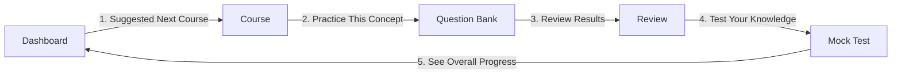
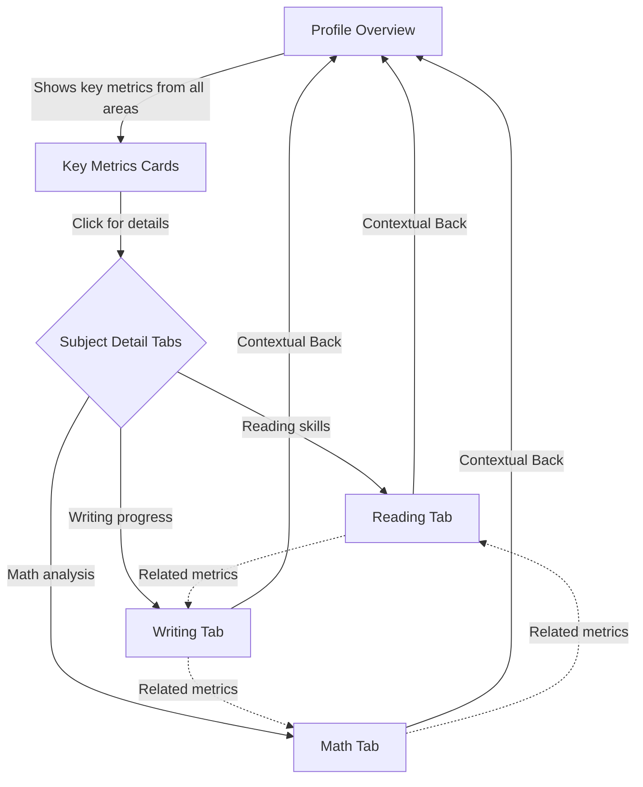
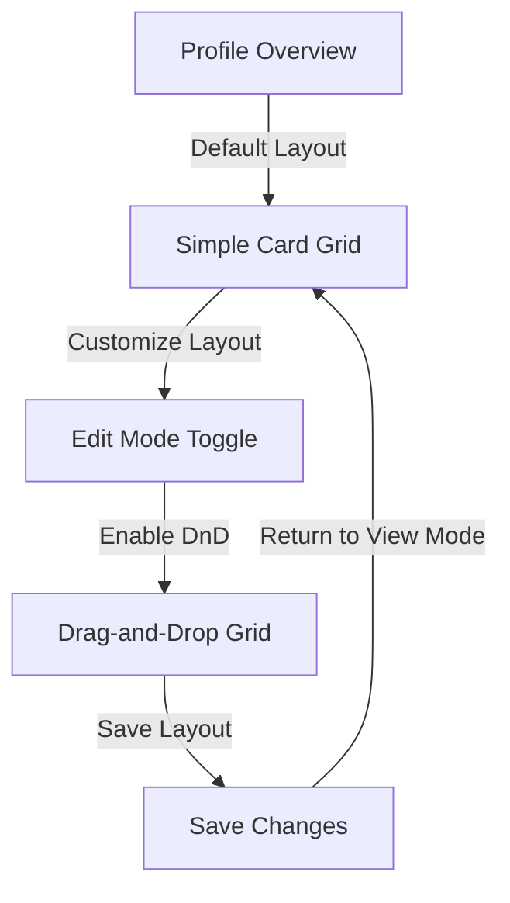

# Optimized User Flow

## Core Principles

Our optimized user flow is guided by these key principles:

1. **Progressive Disclosure**: Present simpler interfaces first with clear paths to advanced features
2. **Logical Learning Journey**: Organize navigation to mirror how users naturally learn and progress
3. **Performance Optimization**: Implement technical solutions to reduce loading times
4. **Contextual Relationships**: Connect related data across the app for a cohesive experience
5. **Accessibility**: Ensure all users can navigate effectively regardless of technical proficiency

## Improved User Journeys

### 1. Learning Journey Optimization

**Current Flow**: Dashboard → Course → Question Bank → Review → Mock Test  
**Optimized Flow**:

**Key Improvements**:
- Add contextual links between sections (e.g., "Practice this concept" button at end of course section)
- Implement a "learning path" indicator to show users where they are in their journey
- Create a suggested content system that recommends the next logical step
- Establish a circular learning flow that reinforces progress

### 2. Profile Tab Navigation

**Current Flow**: Profile Overview → Subject-specific tabs (navigate manually)  
**Optimized Flow**:

**Key Improvements**:
- Overview cards link directly to relevant detail tabs
- Add contextual navigation between related visualizations across tabs
- Implement "deep linking" for direct access to specific visualizations
- Add "back to overview" with context of where user came from

### 3. Simplified Card Management

**Current System**: Always-editable drag-and-drop grid in Overview tab  
**Optimized System**:

**Key Improvements**:
- Default to a simple, non-editable grid for better performance and reduced complexity
- Add explicit "Edit Mode" toggle to enable drag-and-drop functionality
- Solve hydration issues by only loading DnD components when in edit mode
- Provide layout templates as starting points for customization

## Technical Implementation Recommendations

### 1. Performance Optimizations

- **Progressive Loading**: Use React.lazy and Suspense for code splitting
- **Virtualization**: Implement virtualization for lists and grids with many items
- **Data Management**: Implement SWR or React Query for data fetching with caching
- **Viewport Loading**: Use Intersection Observer to load visualizations only when they come into view
- **Prefetching**: Preload data for likely next views based on user behavior patterns

### 2. Simplified Interface Components

- **SimpleCardGrid**: Create a non-draggable alternative to DraggableCardGrid
- **EditableCardGrid**: Wrap DraggableCardGrid with edit mode toggle and controls
- **ProgressiveChartLoader**: Component that loads chart data incrementally with skeleton states

### 3. Navigation Enhancements

- **PathIndicator**: Show users where they are in their learning journey
- **ContextualNav**: Navigation component that suggests next logical steps
- **RelatedContentLinks**: Component that shows related content across different sections

### 4. Data Fetching Strategy

- Implement shared state or context for related visualizations
- Create centralized data hooks for common data requirements
- Use stale-while-revalidate pattern to show existing data while fetching updates

## Expected Outcomes

The optimized user flow should result in:

1. **Improved Performance**: Faster initial load times and smoother interactions
2. **Reduced Complexity**: Simpler default interfaces with optional advanced features
3. **Clearer Navigation**: More intuitive movement between application sections
4. **Better Learning Experience**: Guided journeys that follow natural learning progression
5. **Enhanced Data Visualization**: More contextual and interconnected data presentation
