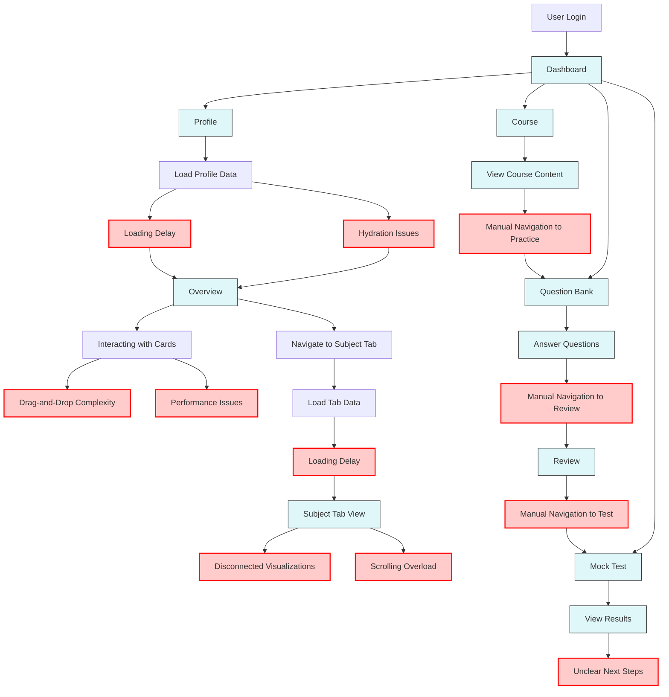
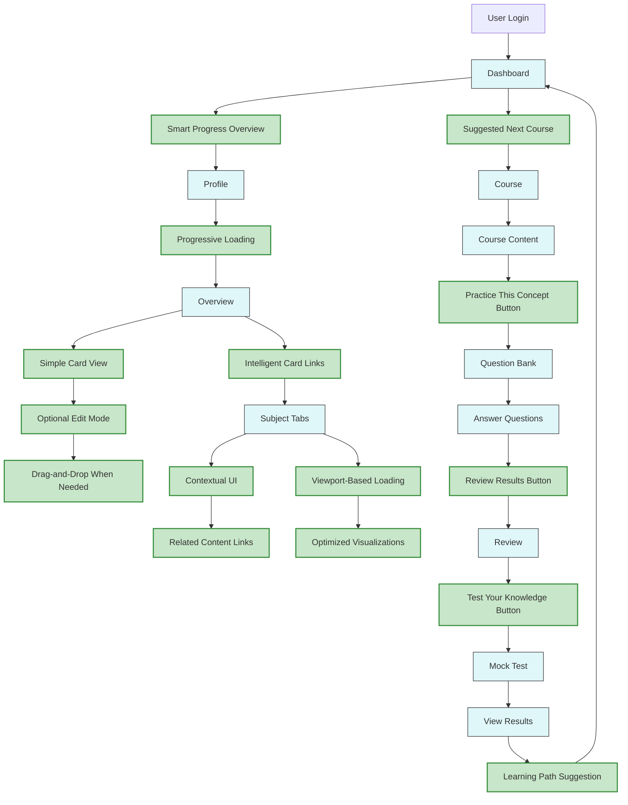
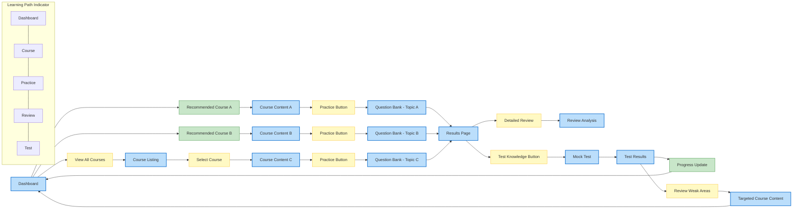
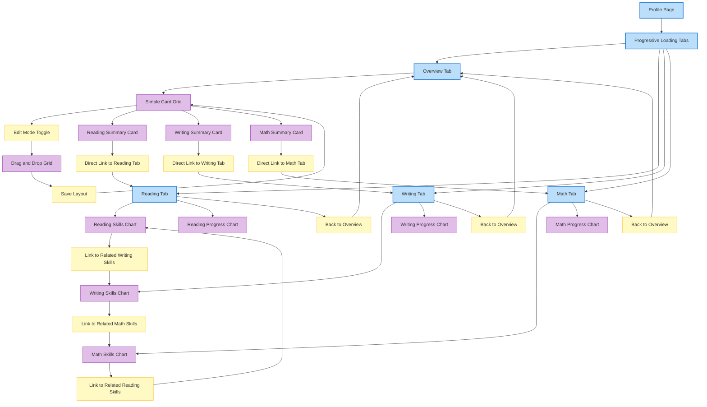
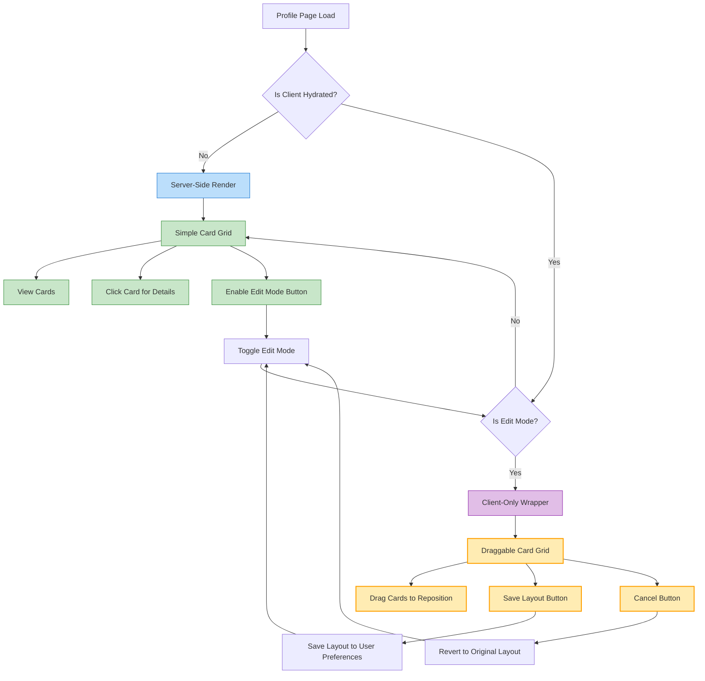
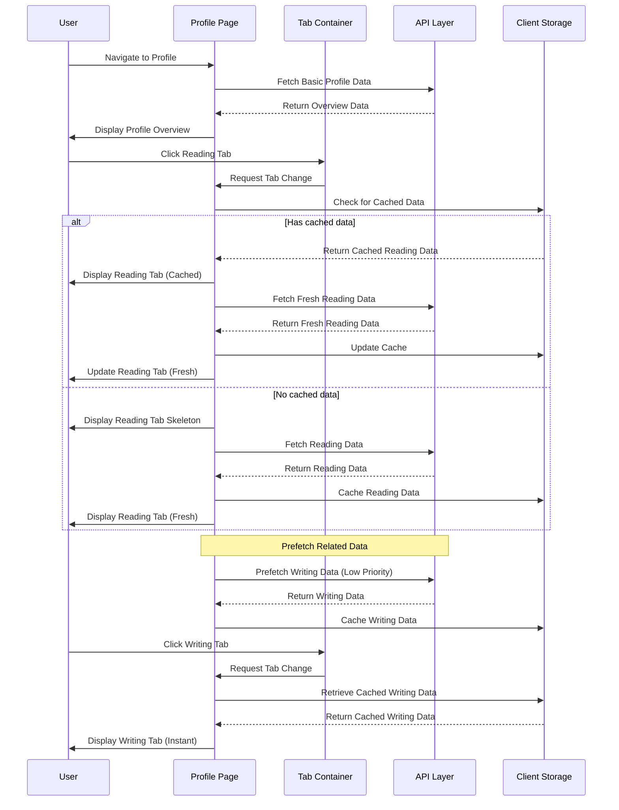

# User Flow Diagrams

This document contains detailed mermaid charts visualizing both the current and optimized user flows for the educational platform.

## Application Structure Overview

```mermaid
graph TD
    classDef mainSection fill:#f9d5e5,stroke:#333,stroke-width:2px;
    classDef subSection fill:#eeeeee,stroke:#333,stroke-width:1px;
    classDef interaction fill:#e3f2fd,stroke:#333,stroke-width:1px;
    
    App[Educational Platform] --> Dashboard
    App --> Profile
    App --> Course
    App --> QuestionBank[Question Bank]
    App --> Review
    App --> MockTest[Mock Test]
    
    Profile --> Overview
    Profile --> Reading
    Profile --> Writing
    Profile --> Math
    
    Overview --> Cards[Draggable Cards]
    Overview --> Summary[Progress Summary]
    
    Reading --> ReadingSkills[Skills Analysis]
    Reading --> ReadingProgress[Progress Tracking]
    
    Writing --> WritingSkills[Skills Analysis]
    Writing --> WritingProgress[Progress Tracking]
    
    Math --> MathSkills[Skills Analysis]
    Math --> MathProgress[Progress Tracking]
    
    Course --> CourseContent[Learning Material]
    Course --> Exercises
    
    QuestionBank --> Questions
    QuestionBank --> Topics
    QuestionBank --> Difficulty
    
    Review --> Feedback
    Review --> Performance
    
    MockTest --> TestContent[Test Questions]
    MockTest --> Results
    
    Dashboard:::mainSection
    Profile:::mainSection
    Course:::mainSection
    QuestionBank:::mainSection
    Review:::mainSection
    MockTest:::mainSection
    
    Overview:::subSection
    Reading:::subSection
    Writing:::subSection
    Math:::subSection
    
    Cards:::interaction
    ReadingSkills:::interaction
    WritingSkills:::interaction
    MathSkills:::interaction
    Questions:::interaction
```



## Current User Flow with Pain Points



## Optimized User Flow - Overview



## Detailed Learning Journey - Optimized Flow



## Profile Navigation - Optimized Flow



## Card Management System - Optimized Flow



## Data Loading and State Management - Optimized Flow



## Performance Optimization Flow

```mermaid
graph TD
    classDef initialLoad fill:#bbdefb,stroke:#1976d2,stroke-width:2px;
    classDef lazyLoad fill:#c8e6c9,stroke:#388e3c,stroke-width:1px;
    classDef userAction fill:#fff9c4,stroke:#fbc02d,stroke-width:1px;
    
    PageLoad[Initial Page Load]:::initialLoad --> CriticalCSS[Load Critical CSS]:::initialLoad
    CriticalCSS --> ShellRender[Render App Shell]:::initialLoad
    ShellRender --> AboveFold[Load Above-Fold Content]:::initialLoad
    AboveFold --> Hydrate[Hydration]:::initialLoad
    
    Hydrate --> InteractiveShell[Interactive Shell]:::initialLoad
    InteractiveShell --> LazyComponents[Lazy-load Components]:::lazyLoad
    
    LazyComponents --> InView1{In Viewport?}
    InView1 -- Yes --> LoadChart1[Load First Chart]:::lazyLoad
    InView1 -- No --> WaitForScroll1[Wait]
    
    ScrollAction1[User Scrolls]:::userAction --> WaitForScroll1
    WaitForScroll1 --> InView1
    
    LoadChart1 --> InView2{Next Chart In Viewport?}
    InView2 -- Yes --> LoadChart2[Load Second Chart]:::lazyLoad
    InView2 -- No --> WaitForScroll2[Wait]
    
    ScrollAction2[User Scrolls Again]:::userAction --> WaitForScroll2
    WaitForScroll2 --> InView2
    
    InteractiveShell --> Prefetch[Prefetch Likely Next Routes]:::lazyLoad
    
    TabClick[User Clicks Tab]:::userAction --> HasCachedData{Has Cached Data?}
    HasCachedData -- Yes --> ShowCached[Show Cached Data]:::lazyLoad
    HasCachedData -- No --> ShowSkeleton[Show Skeleton]:::lazyLoad
    
    ShowCached --> FetchFresh[Fetch Fresh Data]:::lazyLoad
    ShowSkeleton --> FetchFresh
    FetchFresh --> UpdateView[Update View]:::lazyLoad
